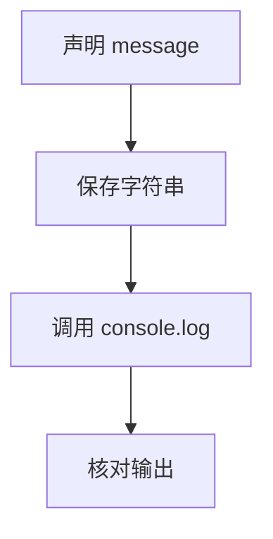

# DAY00 · Practice 01：Day 00：第一段完整程序

[返回当天课程](../README.md)

这是一道完整、独立的主练习。不要导入其他 practice 文件夹中的代码。

## 代码流程图



打开 `practice.ts`。文件中只有说明注释；请从下一行开始亲手输入完整程序。

需求：

1. 声明一个名为 `message` 的变量。
2. 让它保存字符串 `"Hello, TypeScript!"`。
3. 使用 `console.log` 输出这个变量。

精确期望输出：

```text
Hello, TypeScript!
```

限制：

- 不要把输出拆成多行。
- 大小写、英文逗号、空格和感叹号必须完全一致。
- 输出必须来自变量 `message`。
- 不要修改 `example.ts` 或检查文件来让练习通过。

完成标准：

- 代码由你从变量声明开始完整输入。
- 保存后没有 TypeScript 错误。
- 右击运行 `practice.ts`，实际输出与期望输出完全一致。

## 本题易漏语法

console.log(message); 中函数名后是圆括号，参数在括号内，语句以分号结束。

## 文件

- 在 `practice.ts` 中独立作答。
- 独立完成并自检后，再查看 `solution.ts` 的 TODO 解题结构与 `SOLUTION.md` 的结构提示；它们不提供完整答案。
