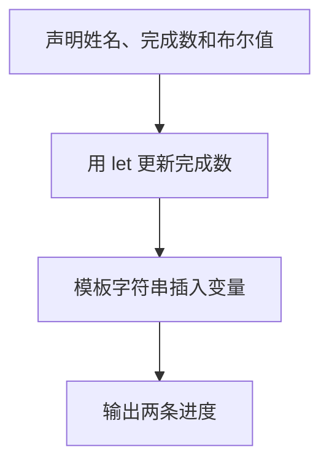

# Day 01：值、变量和三个最常用的类型

预计用时：75–90 分钟。

程序需要记住信息。姓名和课程是文字，完成数量是数字，“是否为初学者”是真或假。TypeScript 会帮助我们说明并检查这些值的类型。

## 完成后你会做到

- 区分值、变量名和类型。
- 使用 `const` 保存不需要重新赋值的数据。
- 使用 `let` 保存会变化的数据。
- 认识 `string`、`number`、`boolean`。
- 理解类型标注和类型推断。
- 使用模板字符串组合输出。

## 值、变量名与类型

阅读这一行：

```ts
const courseName = "TypeScript";
```

`"TypeScript"` 是值，`courseName` 是方便代码重复使用它的变量名，`string` 是这类值的类型。

三个最常用的基础类型是：

- `string`：文字，例如 `"Lin"`。
- `number`：数字，例如 `2` 或 `0.5`。
- `boolean`：只有不带引号的 `true` 和 `false`。

带引号的 `"2"` 是字符串，不是数字；带引号的 `"true"` 也是字符串，不是布尔值。

## `const`、`let` 与赋值

默认优先使用 `const`。只有变量稍后确实需要重新赋值时才使用 `let`：

```ts
let completedLessons = 0;
completedLessons = completedLessons + 1;
```

等号右边先读取旧值并计算，新的结果再赋回左边变量。若变量使用 `const`，TypeScript 会阻止重新赋值。

## 类型标注与类型推断

下面两种写法都能得到字符串类型：

```ts
const learnerName: string = "Lin";
const courseName = "TypeScript";
```

第一行明确写了类型标注，第二行由 TypeScript 根据初始值推断。初始值已经很清楚时，不必重复标注明显类型。基础类型名称应使用小写 `string`、`number`、`boolean`。

## 模板字符串

反引号创建模板字符串，`${...}` 会插入变量当前的值：

```ts
const summary = `课程: ${courseName}`;
```

反引号不是单引号。它通常位于键盘左上角、数字 1 左侧。

## 阅读完整示例

打开并右击运行 `example.ts`。先预测 `completedLessons` 增加前后的值，再对照输出。可以临时把数字赋值改成字符串，观察 TypeScript 怎样在运行前指出错误；实验后撤销并保存。

## Example 代码流程图

运行 `example.ts` 前先沿图预测执行顺序；运行后再把每个节点对应到代码行。



## 独立练习导航

本日共有 2 道独立练习。每道题都有单独目录、说明、作答文件和解题结构提示；题目之间不共享代码。

| 目录 | 场景 | 类型 |
| --- | --- | --- |
| [practice01](./practice01/README.md) | Day 01：学习档案 | 主任务 |
| [practice02](./practice02/README.md) | 学习进度卡 | 闭卷迁移 |

右击任意练习目录中的 `practice.ts` 即可单独检查；命令行也可运行 `npm run beginner -- day01 practice02`。

## 常见错误

把反引号写成普通引号会让 `${变量名}` 原样显示；把 `true` 放进引号会改变类型；用 `const` 声明需要更新的变量会产生重新赋值错误。

### 错误代码示例

```ts
const completedLessons = 0;
completedLessons = completedLessons + 1; // ❌ const 变量不能重新赋值。

const isBeginner = "true"; // ❌ 这是 string，不是 boolean。
console.log("已完成: ${completedLessons}"); // ❌ 普通引号不会插入变量。
```

### 正确写法

```ts
let completedLessons = 0;
completedLessons = completedLessons + 1; // ✅ 会变化的绑定使用 let。

const isBeginner = true; // ✅ 布尔值不加引号。
console.log(`已完成: ${completedLessons}`); // ✅ 模板字符串使用反引号。
```

## 拓展思考（不要求写代码）

如果课程名称也要在程序运行过程中从 `"TypeScript"` 改成 `"JavaScript"`，应只把哪一个变量从 `const` 改成 `let`，为什么其他变量不需要跟着改变？

## 解题结构提示

`solution.ts` 与 `SOLUTION.md` 只提供带 TODO 的结构提示，不提供完整答案。

完成后再进入对应的 `practiceXX` 目录查看 `solution.ts` 与 `SOLUTION.md`。先比较自己的变量选择和更新过程，再比较输出格式。

## 官方资料

- [Everyday Types：基础类型与类型推断](https://www.typescriptlang.org/docs/handbook/2/everyday-types.html)
- [The Basics：静态类型检查](https://www.typescriptlang.org/docs/handbook/2/basic-types.html)
