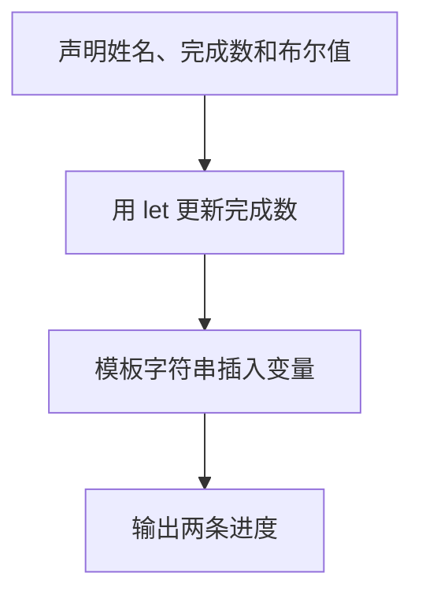

# DAY01 · Practice 02：学习进度卡

[返回当天课程](../README.md)

这是一道与 Practice 01 文件完全分开的闭卷迁移题。先理解并运行当天 `example.ts`，然后关闭它；不要复制代码，仅根据下面的流程与输出从空白重新实现。

## 代码流程图



## 必须练到的能力

使用 const、let、string、number、boolean 和模板字符串。

- 不得导入 `practice01` 或直接调用其他练习的实现。
- 输出必须由变量、计算或函数返回值产生，不把整行结果写死。
- 每个参数、局部变量和返回值都应能在流程图中找到位置。

## 精确期望输出

```text
Ada completed 1 lesson. Beginner: true
Zoran completed 2 and Lesson Beginner is: true
```

## 文件

在本目录的 `practice.ts` 作答；独立完成后再查看 `solution.ts` 的 TODO 解题结构与 `SOLUTION.md` 的结构提示，它们不提供完整答案。
