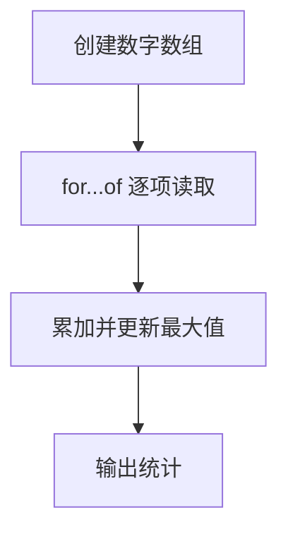

# DAY03 · Practice 01：Day 03：学习时长报告

[返回当天课程](../README.md)

这是一道完整、独立的主练习。不要导入其他 practice 文件夹中的代码。

## 代码流程图



在 `practice.ts` 中从零完成“学习时长报告”。

固定数据和名称：

- `studyMinutes` 是数字数组 `[30, 45, 60, 20]`。
- `totalMinutes` 是从 0 开始的累加变量。
- `longestSession` 是从 0 开始的最长记录。
- 循环中的当前元素命名为 `minutes`。

程序要求：

1. 使用一个 `for...of` 循环处理整个数组。
2. 每轮把 `minutes` 累加到 `totalMinutes`。
3. 只有 `minutes > longestSession` 时才更新最长记录。
4. 使用 `.length`、总计变量和最长变量生成三行输出。

精确期望输出：

```text
Sessions: 4
Total minutes: 155
Longest session: 60
```

限制：

- 不得手工把四个数字逐个相加。
- 不得把 4、155 或 60 直接写进输出。
- 不得使用尚未学习的 `reduce`、`Math.max`。
- 循环必须使用 `for...of`。

完成标准：

- 能手工说明四轮中两个统计变量的变化。
- 修改数组内容后，统计会随数据自动变化。
- 右击运行 `practice.ts` 后，三行输出完全一致。

## 本题易漏语法

数组值用 []，项目用逗号；for (const item of items) { ... } 中圆括号是循环头，花括号是循环体。

## 文件

- 在 `practice.ts` 中独立作答。
- 独立完成并自检后，再查看 `solution.ts` 的 TODO 解题结构与 `SOLUTION.md` 的结构提示；它们不提供完整答案。
