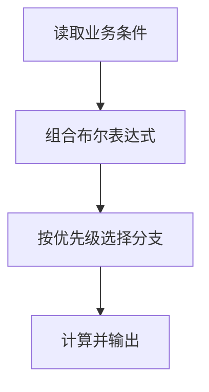

# DAY04 · Practice 01：Day 04：订单优惠计算器

[返回当天课程](../README.md)

这是一道完整、独立的主练习。不要导入其他 practice 文件夹中的代码。

## 代码流程图



在 `practice.ts` 中从零完成“订单优惠计算器”。

固定数据和名称：

- `orderTotal` 为数字 `120`。
- `isMember` 为布尔值 `true`。
- `hasCoupon` 为布尔值 `false`。
- `canUseMemberDiscount` 保存组合条件。
- `discount` 从数字 0 开始。
- `amountToPay` 保存应付金额。

优惠规则必须按以下优先级实现：

1. 订单满 200，优惠 40。
2. 否则，如果是会员、订单满 100 且没有优惠券，优惠 20。
3. 否则，如果有优惠券或订单满 80，优惠 10。
4. 否则不优惠。

程序要求：

- `canUseMemberDiscount` 必须使用 `&&` 和 `!` 组合三个条件。
- 优惠规则必须使用一个 `if / else if / else` 结构。
- 应付金额由 `orderTotal - discount` 计算。
- 所有输出都读取变量。

精确期望输出：

```text
会员优惠可用: true
优惠: 20
应付: 100
```

限制：

- “满 200”和“满 100”都必须包含边界。
- 不得直接把 20 或 100 写进输出。
- 不得用多个互不相关的 `if` 让多条优惠同时叠加。
- 不使用嵌套三元表达式。

完成标准：

- 能说明当前数据为什么进入第二个分支。
- 能解释 `&&`、`||`、`!` 在程序中的不同作用。
- 右击运行 `practice.ts`，三行输出完全一致。

## 本题易漏语法

比较用 >=、严格相等用 ===；多分支写 } else if (...) {，不要把互斥规则拆成叠加的 if。

## 文件

- 在 `practice.ts` 中独立作答。
- 独立完成并自检后，再查看 `solution.ts` 的 TODO 解题结构与 `SOLUTION.md` 的结构提示；它们不提供完整答案。
