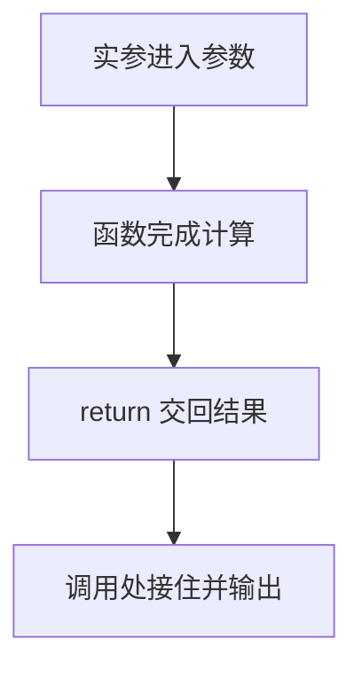

# DAY05 · Practice 01：Day 05：会员账单函数

[返回当天课程](../README.md)

这是一道完整、独立的主练习。不要导入其他 practice 文件夹中的代码。

## 代码流程图



在 `practice.ts` 中从零完成“会员账单”。

必须声明这些函数：

- `calculateSubtotal(quantity: number, unitPrice: number): number`：返回数量乘单价。
- `calculateDiscount(subtotal: number, isMember: boolean): number`：会员并且小计至少 100 时返回小计的 10%，否则返回 0。
- `calculateAmountToPay(subtotal: number, discount: number): number`：返回小计减优惠。

固定数据与名称：

- `quantity` 为 3。
- `unitPrice` 为 40。
- `isMember` 为 `true`。
- 调用结果依次保存为 `subtotal`、`discount`、`amountToPay`。

精确期望输出：

```text
小计: 120
优惠: 12
应付: 108
```

限制：

- 三个函数都必须明确标注参数类型和返回值类型。
- 计算函数内部不得调用 `console.log`。
- 函数不得读取或修改题目中的外部变量。
- 不得把 120、12、108 直接写入输出语句。
- 只在所有计算完成后输出三行。

完成标准：

- 能指出每个函数的输入和返回值。
- 相同参数重复调用函数会得到相同结果。
- 右击运行 `practice.ts`，没有额外日志且三行完全一致。

## 本题易漏语法

函数头写 function 名称(参数: 类型): 返回类型 {；形参与实参用逗号，return 值; 交回结果。

## 文件

- 在 `practice.ts` 中独立作答。
- 独立完成并自检后，再查看 `solution.ts` 的 TODO 解题结构与 `SOLUTION.md` 的结构提示；它们不提供完整答案。
