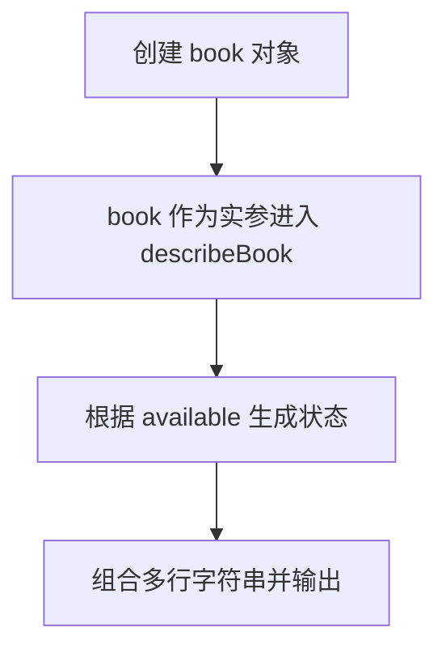

# Day 06：对象与引用

预计用时：60–90 分钟。

对象可以把同一事物的多项信息放在一起，例如任务标题、完成状态、学习者资料和分数。本课还会处理一个很容易被忽略的问题：把对象赋给另一个变量，只会复制引用，不会自动创建独立对象。

## 完成目标

- 创建对象并用点号读取、修改属性。
- 把对象传给函数，并描述函数需要的对象形状。
- 读取嵌套对象和对象里的数组。
- 使用循环处理对象中的数组。
- 理解对象赋值复制的是引用。

## 对象与属性

```ts
const task = {
  title: "学习对象",
  done: false,
};

console.log(task.title);
```

花括号中每一项是属性。对象内部使用 `属性名: 值`，变量声明仍使用 `=`。TypeScript 会从初始值推断每个属性的类型。

嵌套对象需要逐层使用点号：

```ts
const student = {
  name: "Mei",
  address: {
    city: "成都",
  },
};

console.log(student.address.city);
```

## 对象作为函数参数

函数可以直接描述需要的对象形状：

```ts
function readScores(record: { scores: number[] }): number {
  return record.scores.length;
}
```

调用者可以拥有更多属性，但必须至少提供函数声明需要的 `scores`。重复使用的对象形状会在 Day 09 学习如何取名。

## 引用与独立副本

```ts
const original = { done: false };
const alias = original;
alias.done = true;
```

`original.done` 也会变成 `true`，因为两个变量指向同一个对象。`const alias = original` 只复制了通往对象的引用。

今天先通过明确创建新对象、逐项复制属性来获得独立副本。嵌套对象和数组也各自是引用；若副本需要完全独立，这些层也要单独创建。更简洁的展开语法会在后续课程学习。

## 阅读完整示例

打开并右击运行 `example.ts`。找出书本对象的三个属性和函数参数形状。临时新增一个作者属性，并观察对象与参数形状是否都需要它；实验后恢复。

## 全局循环与独立函数：两种写法的数据流

同一段“循环读取分数并 push 到新数组”的逻辑，可以直接写在文件顶层，也可以封装进函数。两种写法都正确，区别在于变量的作用域、复用方式和调用者能看到多少细节。

### 写法一：在全局代码中循环

```ts
const copiedScores: number[] = [];

for (const score of originalTask.scores) {
  copiedScores.push(score);
}
```

这里的变量关系是：

- `copiedScores` 在循环外声明，后面的文件代码仍然可以读取它。
- `score` 在 `for` 的花括号内声明，只代表当前一轮的分数；循环外不能使用它。
- 每一轮都直接修改外部的 `copiedScores`。这很直观，但如果别处也要复制数组，就会重复整段循环。
- `const copiedScores` 仍然可以 `push`，因为变量一直指向同一个数组；不能做的是把它重新赋值成另一个数组。

### 写法二：封装为可复用函数

```ts
function copyScores(source: number[]): number[] {
  const result: number[] = [];

  for (const score of source) {
    result.push(score);
  }

  return result;
}

const copiedScores = copyScores(originalTask.scores);
```

逐步追踪这次调用：

1. `originalTask.scores` 是调用处传入的实参。
2. 函数开始执行后，这个数组引用由局部参数 `source` 接收；参数名不必和外部变量名相同。
3. `result` 是函数内部新建的局部数组，`score` 是每轮循环的局部变量。函数外不能直接访问它们。
4. `result.push(score)` 修改的是新数组，不是 `source` 指向的原数组；若写成 `source.push(...)`，反而会修改调用者的原分数。
5. `return result;` 把新数组交回调用位置，外部再用 `copiedScores` 接住它。只调用函数但不接返回值，结果不会自动出现在某个外部变量中。

函数版把“怎样复制”藏在一个有名字的功能里。相同函数可以接收别的数字数组，也能单独测试。今天先亲手完成全局版，再重构成函数版，输出不应改变。

## Example 代码流程图

运行 `example.ts` 前先沿图预测执行顺序；运行后再把每个节点对应到代码行。



## 独立练习导航

本日共有 3 道独立练习。每道题都有单独目录、说明、作答文件和解题结构提示；题目之间不共享代码。

| 目录 | 场景 | 类型 |
| --- | --- | --- |
| [practice01](./practice01/README.md) | Day 06：学习任务副本与成绩报告 | 主任务 |
| [practice02](./practice02/README.md) | 图书借阅卡 | 闭卷迁移 |
| [practice03](./practice03/README.md) | 购物车深复制函数 | 综合应用 |

右击任意练习目录中的 `practice.ts` 即可单独检查；命令行也可运行 `npm run beginner -- day06 practice02`。

## 常见错误

`const copy = original` 不会复制对象；只复制顶层但复用 `student` 或 `scores`，仍会共享嵌套引用；属性拼写和大小写必须一致。

### 错误代码示例

```ts
const student { name = "Lin" };
// ❌ 变量名后缺少 =；对象属性的名称和值之间应使用 :。
```

即使对象语法写对，下面的写法仍没有复制数据：

```ts
const originalTask = {
  student: { name: "Lin" },
  scores: [88, 92],
};

const copiedTask = originalTask;
copiedTask.scores.push(100);
// ❌ 两个变量指向同一个对象，原任务的 scores 也被修改。
```

### 正确写法

```ts
const student = { name: "Lin" };
// ✅ = 把右侧对象赋给变量；对象内部用 : 连接属性名和值；语句以 ; 结束。

const originalTask = {
  student,
  scores: [88, 92],
};
const copiedScores: number[] = [];

for (const score of originalTask.scores) {
  copiedScores.push(score); // ✅ 逐项加入显式创建的新数组。
}

const copiedTask = {
  student: { name: originalTask.student.name }, // ✅ 新的嵌套对象。
  scores: copiedScores, // ✅ 与原对象使用不同的数组。
};

copiedTask.scores.push(100); // ✅ 只修改副本的数组。
```

## 拓展思考（不要求写代码）

如果 `copiedTask.student` 直接使用 `originalTask.student`，随后修改副本学生的城市，为什么原任务中的城市也会变化，而本题单独创建嵌套对象后不会？

## 解题结构提示

`solution.ts` 与 `SOLUTION.md` 只提供带 TODO 的结构提示，不提供完整答案。

完成后再进入对应的 `practiceXX` 目录阅读 `solution.ts` 与 `SOLUTION.md`，并尝试画出两套对象结构。

## 官方资料

- [Everyday Types：Object Types](https://www.typescriptlang.org/docs/handbook/2/everyday-types.html#object-types)
- [Object Types](https://www.typescriptlang.org/docs/handbook/2/objects.html)
