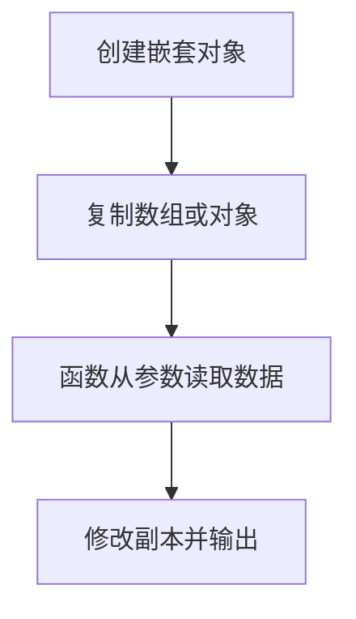

# DAY06 · Practice 01：Day 06：学习任务副本与成绩报告

[返回当天课程](../README.md)

这是一道完整、独立的主练习。不要导入其他 practice 文件夹中的代码。

## 代码流程图



在 `practice.ts` 中从零完成“学习任务副本与成绩报告”。

创建 `originalTask`，固定结构如下：

- `title` 为 `"完成对象练习"`。
- `done` 为 `false`。
- `student` 是嵌套对象，包含 `name: "Mei"` 和 `city: "成都"`。
- `scores` 是数字数组 `[88, 92, 90]`。

程序要求：

1. 创建空数字数组 `copiedScores`，使用 `for...of` 把原数组的每个分数 `push` 进去。
2. 创建新对象 `copiedTask`，逐项读取原对象的值；`student` 必须是新对象，`scores` 使用 `copiedScores`。
3. 只把 `copiedTask.done` 修改为 `true`。
4. 实现 `calculateAverage(record: { scores: number[] }): number`，用循环计算平均分。
5. 输出原任务与副本状态、嵌套学生资料和平均分。

精确期望输出：

```text
原任务完成: false
副本完成: true
学生: Mei（成都）
平均分: 90
```

限制：

- 不得写 `const copiedTask = originalTask`。
- 不使用尚未学习的对象或数组展开语法。
- 平均分必须根据数组循环计算，不得直接写 90。
- 函数必须从参数读取分数，不得读取外部 `originalTask`。

完成标准：

- 修改副本后，原对象仍保持 `false`。
- 能画出原对象和副本各自指向的嵌套对象与数组。
- 右击运行 `practice.ts`，四行输出完全一致。

## 本题易漏语法

对象值写 `const student = { name: "Mei", scores: [88] };`：变量名后用 `=`，值属性内部用 `:`，属性之间用逗号，数组用 `[]`。对象参数类型写 `{ name: string; scores: number[] }`：属性名与类型之间仍用 `:`，类型属性推荐用分号。对象值关闭后是 `};`，函数或循环代码块关闭后通常只有 `}`。

## 文件

- 在 `practice.ts` 中独立作答。
- 独立完成并自检后，再查看 `solution.ts` 的 TODO 解题结构与 `SOLUTION.md` 的结构提示；它们不提供完整答案。
