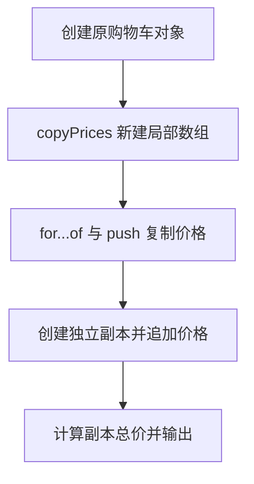

# DAY06 · Practice 03：购物车深复制函数

[返回当天课程](../README.md)

把购物车价格数组复制成独立数组，修改副本后计算总价，确认原购物车不受影响。

## 代码流程图



## 要求

- 从空白文件完成本题需要的类型、函数、固定输入与输出。
- 不得导入其他 practice 文件夹。
- 计算必须来自参数和局部变量；函数用 return 交付结果。
- 保持原数据不变，并按流程图处理边界或状态。

## 精确期望输出

```text
Original items: 2
Copied items: 3
Copied total: 60
Customer: Lin
```

## 文件

在本目录的 `practice.ts` 作答；独立完成后再查看 `solution.ts` 的 TODO 解题结构与 `SOLUTION.md` 的结构提示，它们不提供完整答案。
