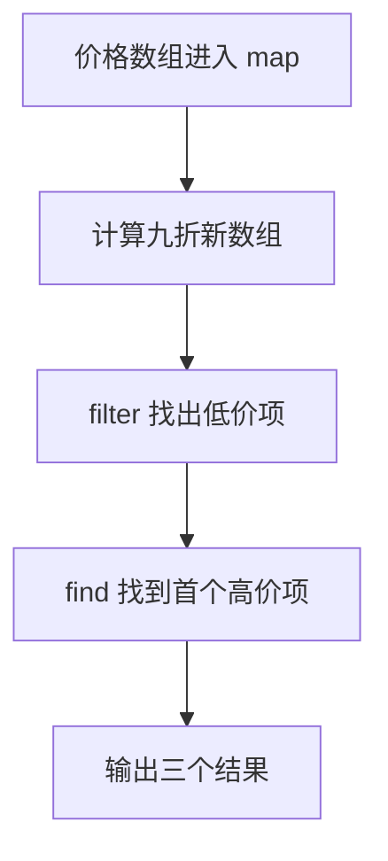

# Day 07：数组方法与回调

预计用时：60–90 分钟。

Day 03 使用 `for...of` 逐项处理数组。今天学习 `map`、`filter` 和 `find`：方法负责遍历，你提供一个小函数说明每一项怎样处理，这个小函数叫回调函数。

## 完成目标

- 使用 `map` 把每一项转换成新值。
- 使用 `filter` 保留满足条件的项。
- 使用 `find` 寻找第一项，并处理可能找不到的情况。
- 读懂箭头函数 `(item) => ...`。
- 理解回调的参数与返回值。

## `map`：每一项变成什么

```ts
const numbers = [1, 2, 3];
const doubled = numbers.map((number) => number * 2);
```

回调参数是当前数组项，箭头右侧是返回的新值。`map` 得到新数组，原数组不变。回调使用花括号时必须明确 `return`，否则新数组中会出现 `undefined`。

## `filter`：哪些项要保留

```ts
const large = numbers.filter((number) => number >= 2);
```

回调返回 `true` 的原数组项被保留，返回 `false` 的项被排除。因此 `filter` 的回调要回答一个布尔问题。

## `find`：第一项在哪里

```ts
const found = numbers.find((number) => number === 2);
```

`find` 只返回第一项；找不到时返回 `undefined`。使用结果前必须显式考虑失败情况。Day 08 会学习更简洁的安全访问写法。

## 箭头函数仍然是函数

箭头左侧是参数，右侧表达式是返回值。初学阶段请把每一步保存为有名称的中间数组，不要把多个操作挤成难以调试的一行。

## 阅读完整示例

打开并右击运行 `example.ts`。依次找出 `map` 产生的新价格、`filter` 保留的价格，以及 `find` 返回的第一项。临时改变阈值，先预测三个结果再运行并恢复。

## 函数变量追踪

数组方法会在内部重复调用回调。每次调用时，当前数组项进入回调参数；回调局部变量在本轮结束后不可用；return 的结果由 map/filter 收集。不要把回调参数误当成外部变量。

## Example 代码流程图

运行 `example.ts` 前先沿图预测执行顺序；运行后再把每个节点对应到代码行。



## 独立练习导航

本日共有 2 道独立练习。每道题都有单独目录、说明、作答文件和解题结构提示；题目之间不共享代码。

| 目录 | 场景 | 类型 |
| --- | --- | --- |
| [practice01](./practice01/README.md) | Day 07：订单数组报告 | 主任务 |
| [practice02](./practice02/README.md) | 商品折扣筛选 | 闭卷迁移 |

右击任意练习目录中的 `practice.ts` 即可单独检查；命令行也可运行 `npm run beginner -- day07 practice02`。

## 常见错误

`map` 用于转换而不是筛选；带花括号的箭头回调漏写 `return` 会产生 `undefined`；`find` 只返回一项而且可能找不到；`filter` 回调必须返回布尔结果。

### 错误代码示例

```ts
const orders = [
  { id: "A1", amount: 40 },
  { id: "B2", amount: 120 },
];

const ids = orders.map((order) => {
  order.id; // ❌ 使用花括号后漏写 return，每一项都会变成 undefined。
});

const largeOrder = orders.find((order) => order.amount >= 100);
console.log(largeOrder.id); // ❌ find 可能返回 undefined，不能直接读取 id。
```

### 正确写法

```ts
const orders = [
  { id: "A1", amount: 40 },
  { id: "B2", amount: 120 },
];

const ids = orders.map((order) => order.id);
// ✅ 单表达式箭头函数会隐式返回 order.id。

const largeOrder = orders.find((order) => order.amount >= 100);

if (largeOrder !== undefined) {
  console.log(largeOrder.id); // ✅ 收窄后才能确定对象存在。
}
```

## 拓展思考（不要求写代码）

如果先把所有订单 `map` 成只包含编号的字符串，再尝试筛选 `status === "done"`，为什么已经无法完成筛选，这说明数组操作的顺序会怎样影响后续可用信息？

## 解题结构提示

`solution.ts` 与 `SOLUTION.md` 只提供带 TODO 的结构提示，不提供完整答案。

完成后再进入对应的 `practiceXX` 目录阅读 `solution.ts` 和 `SOLUTION.md`，重点对照三个数组方法各自保存的中间结果。

## 官方资料

- [Everyday Types：Arrays](https://www.typescriptlang.org/docs/handbook/2/everyday-types.html#arrays)
- [MDN：Array](https://developer.mozilla.org/docs/Web/JavaScript/Reference/Global_Objects/Array)
