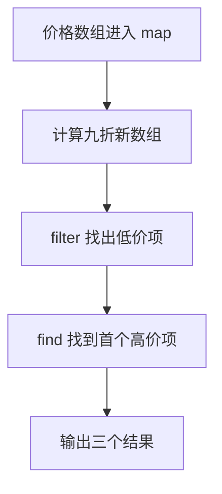

# DAY07 · Practice 02：商品折扣筛选

[返回当天课程](../README.md)

这是一道与 Practice 01 文件完全分开的闭卷迁移题。先理解并运行当天 `example.ts`，然后关闭它；不要复制代码，仅根据下面的流程与输出从空白重新实现。

## 代码流程图



## 必须练到的能力

使用 map、filter、find；回调带花括号时明确 return。

- 不得导入 `practice01` 或直接调用其他练习的实现。
- 输出必须由变量、计算或函数返回值产生，不把整行结果写死。
- 每个参数、局部变量和返回值都应能在流程图中找到位置。

## 精确期望输出

```text
打折后: 13.5, 72, 108, 40.5
低于 50: 13.5, 40.5
第一个至少 100: 120
```

## 文件

在本目录的 `practice.ts` 作答；独立完成后再查看 `solution.ts` 的 TODO 解题结构与 `SOLUTION.md` 的结构提示，它们不提供完整答案。
