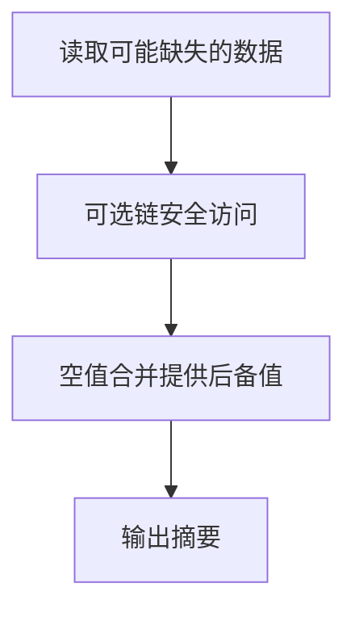

# DAY08 · Practice 01：Day 08：联系人安全摘要

[返回当天课程](../README.md)

这是一道完整、独立的主练习。不要导入其他 practice 文件夹中的代码。

## 代码流程图



在 `practice.ts` 中从零完成“联系人安全摘要”。

声明 `contacts`，显式标注为具有下列形状的对象数组：

- 必填 `name: string`。
- 可选 `phone?: string`。
- 可选 `address?: { city?: string }`。

固定数据：

- 第一项是 `{ name: "Lin", phone: "13800000000", address: { city: "上海" } }`。
- 第二项是 `{ name: "Mei", address: {} }`。

程序要求：

1. 使用 `find` 创建 `selectedContact`，查找名字为 `"Mei"` 的联系人。
2. 使用 `selectedContact?.name ?? "未找到"` 得到 `selectedName`。
3. 用相同思路得到 `selectedPhone`，缺失时显示 `"未提供"`。
4. 安全访问嵌套城市得到 `selectedCity`，缺失时显示 `"未填写"`。
5. 声明 `score: number | undefined = 0` 和 `nickname: string | undefined = ""`。
6. 使用 `??` 为分数提供默认值 100、为昵称提供默认值 `"匿名"`，并用 `JSON.stringify` 显示昵称。

精确期望输出：

```text
联系人: Mei
电话: 未提供
城市: 未填写
分数: 0
昵称: ""
```

限制：

- 不使用非空断言 `!` 或类型断言 `as`。
- 不使用 `||` 提供默认值。
- 不假设 `find` 一定成功。
- 所有结果必须从固定数据安全推导。

完成标准：

- 能指出每条可选链可能在哪一层停止。
- 0 和空字符串不会被默认值替换。
- 右击运行 `practice.ts`，五行输出完全一致。

## 本题易漏语法

?. 是安全访问，?? 只在 null/undefined 时使用后备值；不要与普通点号或 || 混淆。

## 文件

- 在 `practice.ts` 中独立作答。
- 独立完成并自检后，再查看 `solution.ts` 的 TODO 解题结构与 `SOLUTION.md` 的结构提示；它们不提供完整答案。
