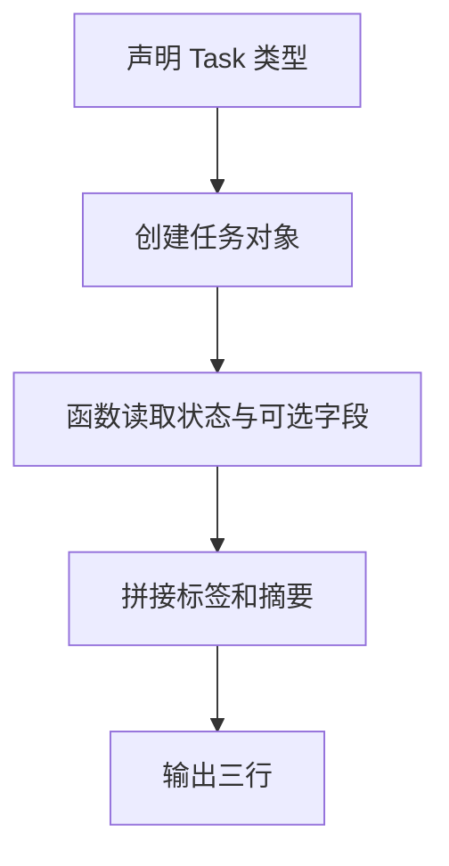

# DAY09 · Practice 02：任务卡片类型

[返回当天课程](../README.md)

这是一道与 Practice 01 文件完全分开的闭卷迁移题。先理解并运行当天 `example.ts`，然后关闭它；不要复制代码，仅根据下面的流程与输出从空白重新实现。

## 代码流程图



## 必须练到的能力

使用 type 或 interface 描述对象，并正确处理 readonly。

- 不得导入 `practice01` 或直接调用其他练习的实现。
- 输出必须由变量、计算或函数返回值产生，不把整行结果写死。
- 每个参数、局部变量和返回值都应能在流程图中找到位置。

## 精确期望输出

```text
T-01 | 学习 type 和 interface | 未完成
备注: 无
标签: TypeScript, 基础
```

## 文件

在本目录的 `practice.ts` 作答；独立完成后再查看 `solution.ts` 的 TODO 解题结构与 `SOLUTION.md` 的结构提示，它们不提供完整答案。
