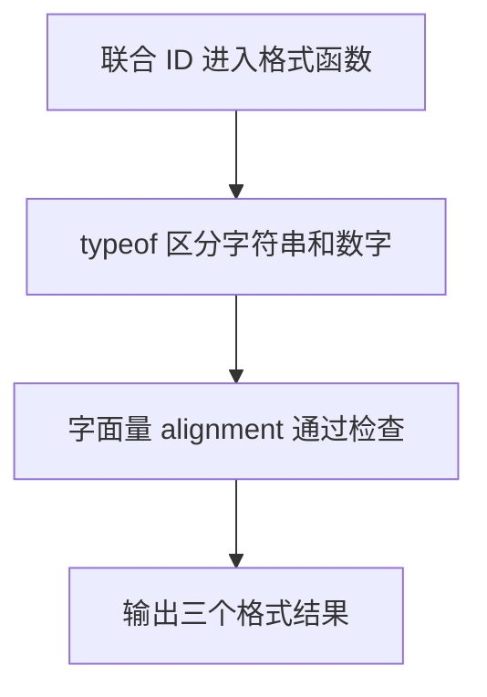

# Day 10：联合类型、字面量类型与收窄

预计用时：60–90 分钟。

一个值有时允许多种类型，例如编号可能是字符串或数字。联合类型表示“当前值是其中一种”，使用某个类型独有的能力前，代码必须先确认它现在是哪一种。这个确认过程叫类型收窄。

## 完成目标

- 使用 `A | B` 声明联合类型。
- 使用字符串字面量联合限制合法选项。
- 使用 `typeof` 收窄基础类型。
- 使用 `Array.isArray` 区分数组。
- 使用相等判断收窄字面量。
- 使用 `in` 区分具有不同属性的对象。
- 理解 `as` 不是运行时检查。

## 联合类型表示多种可能

```ts
type Id = string | number;
```

这不表示值同时是字符串和数字，而表示某一次运行中它可能是其中一种。只能直接使用所有成员都拥有的能力；调用字符串专属的 `toUpperCase` 前，必须先确认当前是字符串。

## `typeof` 收窄基础类型

```ts
function formatId(id: string | number): string {
  if (typeof id === "string") {
    return id.toUpperCase();
  }

  return `#${id}`;
}
```

在 `if` 分支中，TypeScript 知道 `id` 是字符串；剩余分支中只可能是数字。`typeof` 的结果使用小写 `"string"`、`"number"`。

## 字面量联合限制选项

```ts
type Priority = "low" | "medium" | "high";
```

普通 `string` 可以是任意文字，字面量联合只允许列出的三个值。编辑器会提供自动补全并阻止拼写错误。使用 `priority === "high"` 后，分支中的值也会被收窄为这个具体字面量。

## 数组与对象收窄

`Array.isArray(value)` 是判断数组的可靠方式。数组在 JavaScript 中也属于对象，因此不要只写 `typeof value === "object"` 来区分。

对于对象联合，可以检查专属属性：

```ts
if ("email" in contact) {
  return contact.email;
}
```

进入分支后，TypeScript 知道当前对象拥有 `email`。

## 类型断言不是验证

`value as string` 只让编译器暂时相信你的判断，不会把数字转换成字符串，也不会检查运行时数据。能够通过 `typeof`、`Array.isArray`、相等判断或 `in` 收窄时，不应使用断言逃避检查。

## 阅读完整示例

打开并右击运行 `example.ts`。指出每次调用进入 `formatId` 的哪个分支，并观察字面量类型如何限制对齐方式。临时传入非法字面量，阅读错误后撤销。

## 函数变量追踪

联合参数进入函数时仍可能是多个类型。收窄只在当前控制流分支内有效；每个分支最终用 return 把允许的统一结果交回调用处。

## Example 代码流程图

运行 `example.ts` 前先沿图预测执行顺序；运行后再把每个节点对应到代码行。



## 独立练习导航

本日共有 2 道独立练习。每道题都有单独目录、说明、作答文件和解题结构提示；题目之间不共享代码。

| 目录 | 场景 | 类型 |
| --- | --- | --- |
| [practice01](./practice01/README.md) | Day 10：支持工单摘要 | 主任务 |
| [practice02](./practice02/README.md) | 工单编号格式化 | 闭卷迁移 |

右击任意练习目录中的 `practice.ts` 即可单独检查；命令行也可运行 `npm run beginner -- day10 practice02`。

## 常见错误

联合类型不是同时拥有两个成员的所有方法；`typeof` 返回小写文字；`Array.isArray` 比普通对象判断更精确；`as` 不会产生运行时检查；属性名拼错会让 `in` 判断失去意义。

### 错误代码示例

```ts
function formatId(id: string | number): string {
  if (typeof id === "String") {
    return id.toUpperCase();
    // ❌ typeof 不会返回 "String"，这里也无法把 id 收窄为 string。
  }

  return `#${id}`;
}

interface EmailContact {
  email: string;
}

function printEmail(externalValue: unknown): void {
  const contact = externalValue as EmailContact;
  console.log(contact.email.toLowerCase());
  // ❌ as 没有检查外部值；缺少 email 时运行会出错。
}
```

### 正确写法

```ts
function formatId(id: string | number): string {
  if (typeof id === "string") {
    return id.toUpperCase(); // ✅ typeof 返回小写 "string"。
  }

  return `#${id}`;
}

function printEmail(externalValue: unknown): void {
  if (
    typeof externalValue === "object" &&
    externalValue !== null &&
    "email" in externalValue &&
    typeof externalValue.email === "string"
  ) {
    console.log(externalValue.email.toLowerCase());
    // ✅ 运行时逐步检查后，email 才被收窄为 string。
  }
}
```

## 拓展思考（不要求写代码）

如果把来自外部文件的未知值直接写成 `value as EmailContact`，当它实际没有 `email` 属性时程序为什么仍可能出错，而 `"email" in value` 这类运行时检查提供了什么额外保证？

## 解题结构提示

`solution.ts` 与 `SOLUTION.md` 只提供带 TODO 的结构提示，不提供完整答案。

完成后再进入对应的 `practiceXX` 目录阅读 `solution.ts` 与 `SOLUTION.md`，逐个指出四个函数使用的收窄方法。

## 官方资料

- [Everyday Types：Union Types](https://www.typescriptlang.org/docs/handbook/2/everyday-types.html#union-types)
- [Everyday Types：Literal Types](https://www.typescriptlang.org/docs/handbook/2/everyday-types.html#literal-types)
- [Narrowing](https://www.typescriptlang.org/docs/handbook/2/narrowing.html)
