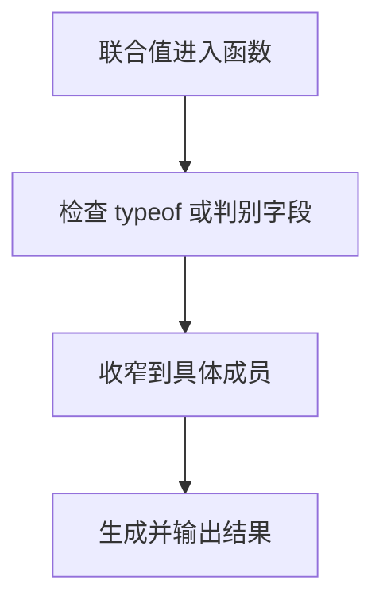

# DAY10 · Practice 01：Day 10：支持工单摘要

[返回当天课程](../README.md)

这是一道完整、独立的主练习。不要导入其他 practice 文件夹中的代码。

## 代码流程图



在 `practice.ts` 中从零完成“支持工单摘要”。

必须声明这些类型：

- `type TicketId = string | number`
- `type TopicInput = string | string[]`
- `type Priority = "low" | "medium" | "high"`
- `interface EmailContact { name: string; email: string }`
- `interface PhoneContact { name: string; phone: string }`
- `type Contact = EmailContact | PhoneContact`

必须实现这些函数：

- `formatTicketId(id: TicketId): string`：字符串编号转大写，数字编号前加 `#`，都带前缀 `"编号: "`。
- `describeTopics(topics: TopicInput): string`：数组返回 `"主题列表: "` 加逗号空格连接；字符串返回 `"主题: "` 加原值。
- `describeContact(contact: Contact): string`：用 `"email" in contact` 返回邮箱或电话。
- `describePriority(priority: Priority): string`：当值为 `"high"` 返回 `"优先级: high（立即处理）"`，其他值返回 `"优先级: "` 加原值。

固定调用数据：

- 工单编号 `"ts-10"` 和 `42`。
- 主题 `"variables"` 和 `["variables", "arrays"]`。
- 邮箱联系人 `{ name: "Lin", email: "a@example.com" }`。
- 电话联系人 `{ name: "Mei", phone: "13800000000" }`。
- 优先级 `"high"`。

精确期望输出：

```text
编号: TS-10
编号: #42
主题: variables
主题列表: variables, arrays
邮箱: a@example.com
电话: 13800000000
优先级: high（立即处理）
```

限制：

- 四个函数都必须使用题目指定的命名类型。
- 分别使用 `typeof`、`Array.isArray`、`in` 和严格相等判断收窄。
- 不使用 `any`、`as` 或非空断言。
- 不得把最终七行整句直接交给 `console.log`。

完成标准：

- 能说明每个分支进入后变量被收窄成什么类型。
- 非法优先级会在运行前被 TypeScript 拒绝。
- 右击运行 `practice.ts`，七行输出完全一致。

## 本题易漏语法

联合成员用 |；先用 typeof、in 或判别字段收窄，再访问特定成员。

## 文件

- 在 `practice.ts` 中独立作答。
- 独立完成并自检后，再查看 `solution.ts` 的 TODO 解题结构与 `SOLUTION.md` 的结构提示；它们不提供完整答案。
