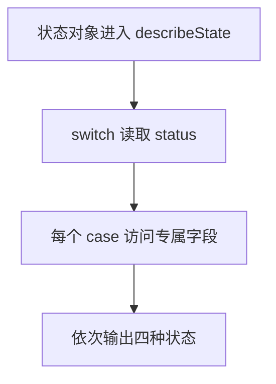

# Day 11：判别联合、switch 与完整分支

预计用时：75–90 分钟。

今天把“一个值可能处于几种状态”写成 TypeScript 能检查的模型。重点不是背诵 `switch`，而是为每种状态保存恰当的数据，并让遗漏分支尽早变成类型错误。

## 核心讲解

判别联合的每个成员都有同名的字面量字段：

~~~ts
type LoadState =
  | { status: "idle" }
  | { status: "success"; items: string[] }
  | { status: "error"; message: string };
~~~

检查 `state.status` 后，TypeScript 会把值收窄到对应成员。因此，只有 `success` 分支能读取 `items`，只有 `error` 分支能读取 `message`。不要把所有字段都改成可选属性；那会允许“成功却没有数据”之类的不合理组合。

`switch` 很适合逐个处理成员。可以在 `default` 中调用穷尽检查函数：

~~~ts
function assertNever(value: never): never {
  throw new Error("未处理的状态：" + JSON.stringify(value));
}
~~~

当联合增加新成员但分支没有同步更新时，传给 `assertNever` 的值不再是 `never`，检查器就会提醒你。成员内部的可选字段仍需单独处理，例如使用 `??` 为缺失分数提供说明。

## 阅读示例

打开 `example.ts`，按项目根目录 README 介绍的右键方式运行。阅读每个 `case`，指出该分支里的 `state` 具体是哪一种类型。

## 函数变量追踪

判别联合参数先进入函数，再由 switch 按判别字段流入某个 case。case 内能读取该成员专属属性；return 结束本次调用并把结果交回外部。

## Example 代码流程图

运行 `example.ts` 前先沿图预测执行顺序；运行后再把每个节点对应到代码行。



## 独立练习导航

本日共有 2 道独立练习。每道题都有单独目录、说明、作答文件和解题结构；题目之间不共享代码。

| 目录 | 场景 | 类型 |
| --- | --- | --- |
| [practice01](./practice01/README.md) | 判别联合、switch 与完整分支 | 主任务 |
| [practice02](./practice02/README.md) | 加载状态渲染器 | 闭卷迁移 |

右击任意练习目录中的 `practice.ts` 即可单独检查；命令行也可运行 `npm run beginner -- day11 practice02`。

## 容易出错的地方

- 在收窄前读取 `score` 或 `reason`。
- 用一个宽泛对象加许多可选属性代替判别联合。
- `default` 直接返回“未知”，让新状态悄悄漏掉。
- 忘记 `case` 中的 `return`。
- 用非空断言掩盖可选的 `score`。

### 错误代码示例

```ts
function describeTask(task: StudyTask): string {
  // ❌ 联合类型尚未按 status 收窄，并非每一种任务都有 score。
  return `${task.title}：${task.score} 分`;
}
```

### 正确写法

```ts
function describeTask(task: StudyTask): string {
  switch (task.status) {
    case "completed":
      // ✅ 进入 completed 分支后才能读取 score；它仍是可选值，所以用 ?? 处理缺席。
      return `${task.title}：${task.score ?? "待评分"}`;
    case "waiting":
      return `${task.title}：待开始`;
    case "studying":
      return `${task.title}：已学习 ${task.minutes} 分钟`;
    case "failed":
      return `${task.title}：${task.reason}`;
    default:
      return assertNever(task);
  }
}
```

## 拓展思考（不要求写代码）

如果以后加入 `{ status: "paused"; title: string; reason: string }`，哪些位置应该发生类型错误？为什么这些错误是在帮助你，而不是阻碍你？

## 官方资料

- [Narrowing：Discriminated unions](https://www.typescriptlang.org/docs/handbook/2/narrowing.html#discriminated-unions)
- [Narrowing：The never type](https://www.typescriptlang.org/docs/handbook/2/narrowing.html#the-never-type)
