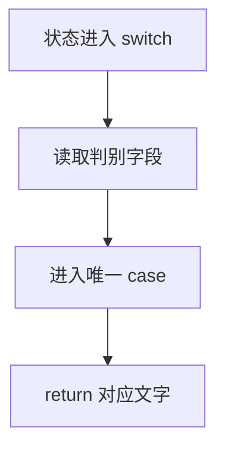

# DAY11 · Practice 01：判别联合、switch 与完整分支

[返回当天课程](../README.md)

这是一道完整、独立的主练习。不要导入其他 practice 文件夹中的代码。

## 代码流程图

请在 `practice.ts` 中从第一行开始编写“学习任务状态说明器”。

固定类型 `StudyTask` 必须包含以下四种联合成员：

- `{ status: "waiting"; title: string }`
- `{ status: "studying"; title: string; minutes: number }`
- `{ status: "completed"; title: string; score?: number }`
- `{ status: "failed"; title: string; reason: string }`

虽然上面只有四种 `status`，`completed` 必须分别测试“有分数”和“无分数”，因此固定输入一共有五项。请实现 `assertNever(value: never): never` 和 `describeTask(task: StudyTask): string`，使用 `switch` 完成收窄，并创建名为 `tasks` 的数组：

~~~text
waiting / 联合类型
studying / 函数 / 45
completed / 对象 / 92
completed / 复习 / 不提供 score
failed / 提交 / 网络中断
~~~

程序必须精确输出：

~~~text
待开始：联合类型
学习中：函数（45 分钟）
已完成：对象（92 分）
已完成：复习（待评分）
失败：提交（网络中断）
~~~

限制：

- 不得把成员专属字段全部改成可选属性。
- 不得使用 `any`、类型断言或非空断言。
- `completed` 分支必须用空值合并处理缺失分数。
- `default` 必须把 `task` 交给 `assertNever`。

完成标准：右键运行 `practice.ts` 后显示 PASS；新增一个 `paused` 成员时，能看到穷尽检查提示缺失分支。

## 本题易漏语法

case "name": 结尾是冒号；用 return 或 break 结束分支，分支里的语句仍用分号。

## 文件

- 在 `practice.ts` 中独立作答。
- 完成并运行通过后，再查看 `solution.ts` 的 TODO 解题结构与 `SOLUTION.md` 的结构提示。
