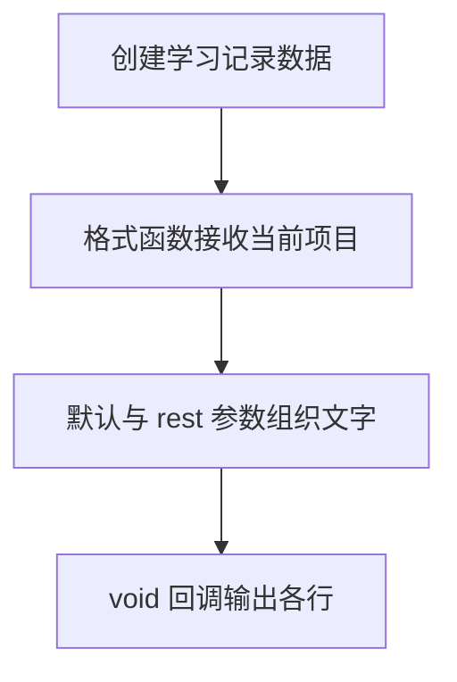

# Day 12：函数类型、箭头函数与回调

预计用时：75–90 分钟。

函数不仅能执行动作，它本身也是一个值：可以存进变量、传给另一个函数，也可以由类型描述。今天会把函数类型、返回值、默认与可选参数、rest 参数和 `void` 回调放进一份成绩报告。

## 核心讲解

函数类型描述参数与返回值的关系：

~~~ts
type Formatter = (value: number) => string;
~~~

箭头函数只有在函数体是单个表达式时才会自动返回。写了花括号后必须明确 `return`：

~~~ts
const double = (value: number): number => {
  return value * 2;
};
~~~

这也是 `map` 回调经常得到一组 `undefined` 的原因。

参数还有三种常用形式：

- `title?: string`：调用者可省略，函数内得到 `string | undefined`。
- `punctuation = "!"`：调用者省略时使用默认值。
- `...values: number[]`：把剩余参数收集为数组。

`void` 常用于报告、日志和事件回调，表示调用者不使用它的返回结果；它不表示函数“什么都不能做”。一个函数可以调用 `void` 回调，同时返回自己的统计结果。

## 阅读示例

打开并右键运行 `example.ts`。找出 `Formatter`、默认参数、rest 参数和 `void` 行为分别出现在哪里。

## 函数变量追踪

高阶函数的数据流多一层：外部把函数值作为实参传入，它在内部成为回调参数；内部再把当前值传给回调；回调 return 的值回到高阶函数。要分清内外两层参数与 return。

## Example 代码流程图

运行 `example.ts` 前先沿图预测执行顺序；运行后再把每个节点对应到代码行。



## 独立练习导航

本日共有 2 道独立练习。每道题都有单独目录、说明、作答文件和解题结构；题目之间不共享代码。

| 目录 | 场景 | 类型 |
| --- | --- | --- |
| [practice01](./practice01/README.md) | 函数类型、箭头函数与回调 | 主任务 |
| [practice02](./practice02/README.md) | 学习记录格式器 | 闭卷迁移 |

右击任意练习目录中的 `practice.ts` 即可单独检查；命令行也可运行 `npm run beginner -- day12 practice02`。

## 容易出错的地方

- 写成 `(value) => { value * 2 }`，忘记 `return`。
- 把 `void` 理解成不能执行输出。
- 直接对可选参数调用字符串方法，没处理 `undefined`。
- 把 rest 参数当作单个数字。
- 在回调里打印正确文字，却忘记返回及格数量。

### 错误代码示例

```ts
const double = (value: number): number => {
  value * 2; // ❌ 使用花括号后不会自动返回，函数实际得到 undefined。
};

function greet(title?: string): string {
  return title.toUpperCase(); // ❌ 可选参数可能是 undefined。
}
```

### 正确写法

```ts
const double = (value: number): number => {
  return value * 2; // ✅ 花括号函数体要明确 return。
};

function greet(title?: string): string {
  return (title ?? "同学").toUpperCase(); // ✅ 先提供默认值，再调用字符串方法。
}
```

## 拓展思考（不要求写代码）

如果 `Reporter` 需要把每条报告异步保存到服务器，它的返回类型和 `reportScores` 的实现应怎样变化，调用者又应等待什么？

## 官方资料

- [More on Functions：Function Type Expressions](https://www.typescriptlang.org/docs/handbook/2/functions.html#function-type-expressions)
- [More on Functions：Optional Parameters](https://www.typescriptlang.org/docs/handbook/2/functions.html#optional-parameters)
- [More on Functions：Rest Parameters](https://www.typescriptlang.org/docs/handbook/2/functions.html#rest-parameters-and-arguments)
- [More on Functions：void](https://www.typescriptlang.org/docs/handbook/2/functions.html#void)
