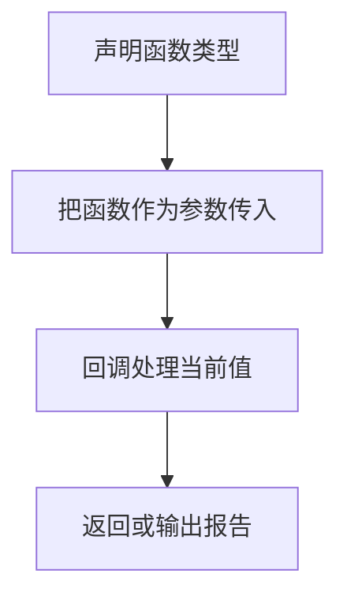

# DAY12 · Practice 01：函数类型、箭头函数与回调

[返回当天课程](../README.md)

这是一道完整、独立的主练习。不要导入其他 practice 文件夹中的代码。

## 代码流程图

请在 `practice.ts` 中从头编写“学生成绩报告器”。

必须创建：

- `ScoreFormatter`：接收 `number`、返回 `string` 的函数类型。
- `Reporter`：接收 `string`、返回 `void` 的函数类型。
- `formatScore`：符合 `ScoreFormatter` 的箭头函数；60 分及以上返回“成绩：分数（通过）”，否则返回“成绩：分数（未通过）”。
- `greetStudent(name, title?, punctuation = "!")`：缺少称呼时使用“同学”。
- `sumScores(...scores)`：返回所有分数之和。
- `reportScores(scores, formatter, reporter)`：逐项调用回调，并返回及格数量。
- 固定数组 `scores`，内容为 `55、80、100`。

用 `console.log` 作为 `Reporter`，精确输出：

~~~text
你好，Ada同学!
成绩：55（未通过）
成绩：80（通过）
成绩：100（通过）
总分：235
通过数量：2
~~~

限制：

- 不得使用 `any` 或类型断言。
- `formatScore` 必须写花括号并明确 `return`。
- `reportScores` 不能把输出写死；它必须调用收到的 `formatter` 和 `reporter`。
- `sumScores` 必须使用 rest 参数，`reportScores` 的数组参数必须是只读数组。
- `console.log` 只负责展示，计算函数必须用 `return` 交付结果。

完成标准：右键运行后显示 PASS；能分别解释可选参数、默认参数、rest 参数与 `void`。

## 本题易漏语法

函数类型中的 => 描述返回类型；箭头函数值中的 => 后面是实现。? 表示可选参数，...args 收集剩余实参。

## 文件

- 在 `practice.ts` 中独立作答。
- 完成并运行通过后，再查看 `solution.ts` 的 TODO 解题结构与 `SOLUTION.md` 的结构提示。
