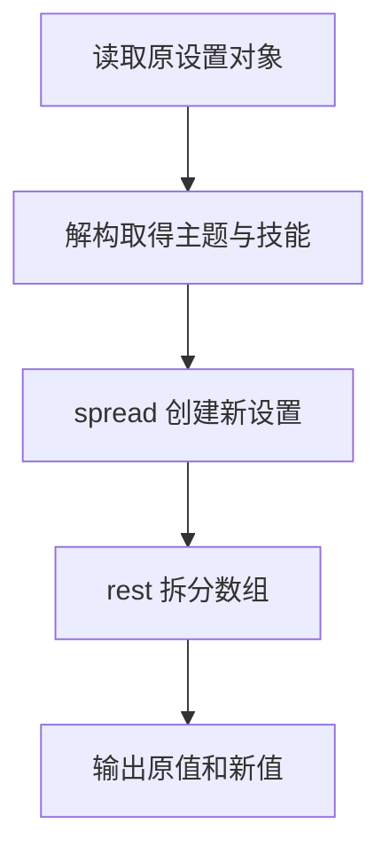

# Day 13：解构、spread、rest 与不可变更新

预计用时：75–90 分钟。

今天学习按结构取值，以及在不改坏旧数据的前提下产生新版本。最容易混淆的是：`const` 只阻止变量重新指向别处，普通对象内部仍可改变；spread 只复制一层。

## 核心讲解

对象与数组可以按结构解构：

~~~ts
const { title } = course;
const [first, ...remaining] = topics;
~~~

这里的 `...remaining` 是 rest，负责收集剩余值。创建新容器时，三个点是 spread，负责展开旧内容：

~~~ts
const newTopics = [...topics, "泛型"];
const renamed = { ...course, title: "TypeScript 入门" };
~~~

spread 只复制当前这一层。若要更新嵌套对象，外层和目标嵌套层都要创建新对象：

~~~ts
const updated = {
  ...profile,
  preferences: {
    ...profile.preferences,
    theme: "dark",
  },
};
~~~

数组中的某个对象要更新时，通常用 `map`：目标项返回新对象，其他项返回原项。“不可变更新”表示不修改旧版本，而是计算新版本；`readonly` 是编译期约束，并不会在运行时自动深度冻结数据。

## 阅读示例

打开并右键运行 `example.ts`。观察原对象与新对象为什么能同时保留不同的主题和技能。

## Example 代码流程图

运行 `example.ts` 前先沿图预测执行顺序；运行后再把每个节点对应到代码行。



## 独立练习导航

本日共有 2 道独立练习。每道题都有单独目录、说明、作答文件和解题结构；题目之间不共享代码。

| 目录 | 场景 | 类型 |
| --- | --- | --- |
| [practice01](./practice01/README.md) | 解构、spread、rest 与不可变更新 | 主任务 |
| [practice02](./practice02/README.md) | 主题设置不可变更新 | 闭卷迁移 |

右击任意练习目录中的 `practice.ts` 即可单独检查；命令行也可运行 `npm run beginner -- day13 practice02`。

## 容易出错的地方

- 写 `const updated = original`，两个名称仍指向同一对象。
- 只 spread 外层，随后修改共享的 `preferences`。
- 使用 `map` 却忘记返回值。
- 直接修改原数组元素或调用 `push`。
- 误以为 `readonly` 或 `as const` 会在运行时深度冻结。

### 错误代码示例

```ts
const updated = { ...original };
updated.preferences.theme = "dark";
// ❌ spread 只复制外层；两个对象仍共享 preferences，original 也被改了。
```

### 正确写法

```ts
const updated = {
  ...original,
  preferences: {
    ...original.preferences,
    theme: "dark", // ✅ 沿着要修改的路径逐层创建新对象。
  },
};
```

## 拓展思考（不要求写代码）

如果每个任务内部又有一个 `history` 数组，要给第二项任务追加历史记录且保留所有旧数据，哪些层级必须创建新容器，哪些未改变的值可以安全复用？

## 官方资料

- [MDN：Destructuring assignment](https://developer.mozilla.org/docs/Web/JavaScript/Reference/Operators/Destructuring_assignment)
- [MDN：Spread syntax](https://developer.mozilla.org/docs/Web/JavaScript/Reference/Operators/Spread_syntax)
- [Object Types：ReadonlyArray](https://www.typescriptlang.org/docs/handbook/2/objects.html#the-readonlyarray-type)
