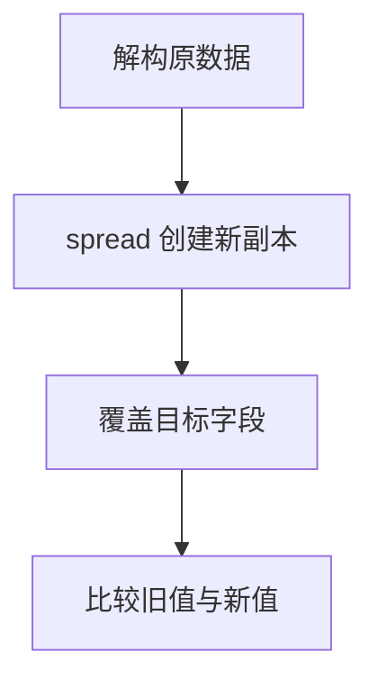

# DAY13 · Practice 01：解构、spread、rest 与不可变更新

[返回当天课程](../README.md)

这是一道完整、独立的主练习。不要导入其他 practice 文件夹中的代码。

## 代码流程图

请在 `practice.ts` 中从头编写“学习资料不可变更新器”。

声明 `Profile`，包含：

- `readonly id: number`
- `name: string`
- `skills: readonly string[]`
- `preferences: { theme: "light" | "dark"; notifications: boolean }`
- `tasks: readonly { id: number; title: string; done: boolean }[]`

创建固定 `original`：

- id 为 1，name 为 `Ada`
- skills 为 `HTML、CSS`
- preferences 为 `light` 和 `true`
- 两项任务分别为 `复习变量`、`练习对象`，初始都未完成

实现 `updateProfile(profile: Profile): Profile`，返回 `updated`，要求：

- name 改为 `Ada Lin`
- skills 末尾加入 `TypeScript`
- theme 改为 `dark`，notifications 保持不变
- 只把 id 为 2 的任务改为完成
- 任何层级都不得修改 `original`

再从 `updated.skills` 解构出 `firstSkill` 和 `remainingSkills`，精确输出：

~~~text
原姓名：Ada
新姓名：Ada Lin
原主题：light
新主题：dark
原技能：HTML、CSS
新技能：HTML、CSS、TypeScript
第一项：HTML
其余：CSS、TypeScript
原状态：false,false
新状态：false,true
~~~

限制：

- 不得使用 `any`、类型断言、非空断言、`push`、`splice` 或直接属性赋值。
- 必须使用对象 spread、数组 spread、嵌套 spread、`map` 和数组 rest。
- `map` 的目标分支返回新任务对象，其他分支返回原任务。
- 输出必须同时读取 `original` 和 `updated`，证明两者没有共享修改。

完成标准：右键运行后显示 PASS；能解释为什么只 spread 最外层仍不足以更新嵌套对象。

## 本题易漏语法

const { name, ...rest } = object 是解构收集；{ ...object, name: next } 是展开新对象，位置决定含义。

## 文件

- 在 `practice.ts` 中独立作答。
- 完成并运行通过后，再查看 `solution.ts` 的 TODO 解题结构与 `SOLUTION.md` 的结构提示。
