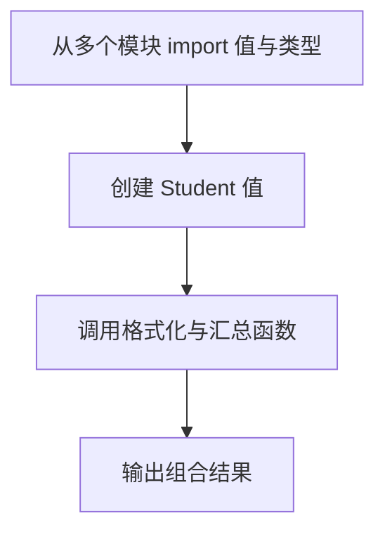

# Day 14：现代 ES Modules 与类型导入

预计用时：60–80 分钟。

程序变大后，需要把数据、函数和类型分到不同文件。现代 JavaScript 使用 ES Modules，也就是 `export` 和 `import`。今天只练习日常项目最常用的具名导入、默认导入和类型导入。

## 核心讲解

具名导出可以在一个文件提供多个成员，导入时使用花括号：

~~~ts
export const courseTitle = "TypeScript";
export const lessonCount = 21;

import { courseTitle, lessonCount } from "./course-data.js";
~~~

默认导出每个模块最多一个，导入时不放在花括号中。默认导入和具名导入也能来自同一个模块：

~~~ts
import formatScore, { passingScore } from "./score-tools.js";
~~~

只需要类型时明确写 `import type`：

~~~ts
import type { Student } from "./student-types.js";
~~~

类型只参与检查，生成 JavaScript 时会被移除；值导入则必须在运行时找到真实导出。课程在 TypeScript 源文件里仍写 `.js` 扩展名，是因为 Node 的 ES Modules 最终运行 JavaScript 路径，`NodeNext` 会把它解析回对应的 `.ts` 源文件。

包含顶层 `import` 或 `export` 的文件是模块。模块内部名称默认只在本文件可见，除非明确导出。不要在多个入口复制同一份共享类型，否则定义会逐渐漂移。

## 阅读示例

打开并右键运行 `example.ts`，然后沿着四条导入路径查看 `course-data.ts`、`score-tools.ts`、`student-types.ts` 与 `student-tools.ts`。这些辅助模块不要修改。

## Example 代码流程图

运行 `example.ts` 前先沿图预测执行顺序；运行后再把每个节点对应到代码行。



## 独立练习导航

本日共有 2 道独立练习。每道题都有单独目录、说明、作答文件和解题结构；题目之间不共享代码。

| 目录 | 场景 | 类型 |
| --- | --- | --- |
| [practice01](./practice01/README.md) | 现代 ES Modules 与类型导入 | 主任务 |
| [practice02](./practice02/README.md) | 课程模块组合 | 闭卷迁移 |

右击任意练习目录中的 `practice.ts` 即可单独检查；命令行也可运行 `npm run beginner -- day14 practice02`。

## 容易出错的地方

- 默认导入误放进花括号，或具名导入忘记花括号。
- 导入后仍保留同名本地声明。
- 使用 `import type` 后尝试把类型当作运行时值输出。
- 删除 `NodeNext` 相对路径中的 `.js`。
- 复制共享类型，导致以后只更新其中一份。

### 错误代码示例

```ts
import { formatScore } from "./score-tools.js";
// ❌ formatScore 是默认导出，默认导入不能放在花括号里。

import type { Student } from "./student-types.js";
console.log(Student); // ❌ 类型导入会在编译后消失，不能当运行时值使用。
```

### 正确写法

```ts
import formatScore, { passingScore } from "./score-tools.js";
// ✅ 默认导入写在花括号外，具名导入写在花括号内。

import type { Student } from "./student-types.js";
const student: Student = { name: "Ada", completed: 12, track: "beginner" };
console.log(formatScore(passingScore), student.name); // ✅ Student 只用于类型位置。
```

## 拓展思考（不要求写代码）

如果 `Student` 新增必填字段 `email`，哪些文件会立刻收到类型提示，哪些只在运行时依赖值导出？这说明类型依赖和值依赖有什么差异？

## 官方资料

- [Modules](https://www.typescriptlang.org/docs/handbook/2/modules.html)
- [Modules：Type-only Import and Export](https://www.typescriptlang.org/docs/handbook/2/modules.html#type-only-imports-and-exports)
