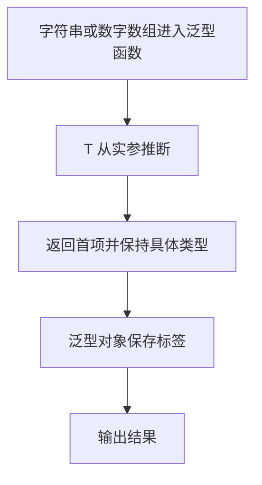

# Day 15：泛型基础与输入输出关系

预计用时：70–90 分钟。

泛型让一份函数或对象类型在复用时仍保留具体类型信息。最重要的不是背尖括号，而是看清同一个类型参数出现在哪些输入和输出位置，它表达了什么关系。

## 核心讲解

字符串数组和数字数组的“取最后一项”逻辑相同。类型参数可以表达：数组元素、回退值和返回值必须保持同一种类型。

~~~ts
function lastOrFallback<Item>(
  items: readonly Item[],
  fallback: Item,
): Item {
  let result = fallback;
  for (const item of items) result = item;
  return result;
}
~~~

泛型不同于 `any`。`any` 会丢失输入与输出关系，泛型会保存它：传入字符串得到字符串，传入数字得到数字。调用时通常让 TypeScript 从实参推断类型参数。

多个类型参数可以描述不同位置的关系：

~~~ts
function makePair<Left, Right>(left: Left, right: Right): [Left, Right] {
  return [left, right];
}
~~~

泛型对象同样可以保留值类型。类型参数不是“拥有所有属性的对象”；如果函数需要读取某个属性，下一章会用约束明确表达。

## 阅读示例

打开并右键运行 `example.ts`。在编辑器中悬停观察 `firstName`、`firstScore` 与 `course.value` 的推断类型。

## 函数变量追踪

泛型函数的运行时数据流与普通函数相同；类型参数只在检查阶段连接输入与输出。实参帮助推断 T，参数按 T 使用，return 仍交回调用处，T 本身不是运行时变量。

## Example 代码流程图

运行 `example.ts` 前先沿图预测执行顺序；运行后再把每个节点对应到代码行。



## 独立练习导航

本日共有 2 道独立练习。每道题都有单独目录、说明、作答文件和解题结构；题目之间不共享代码。

| 目录 | 场景 | 类型 |
| --- | --- | --- |
| [practice01](./practice01/README.md) | 泛型基础与输入输出关系 | 主任务 |
| [practice02](./practice02/README.md) | 泛型首项读取 | 闭卷迁移 |

右击任意练习目录中的 `practice.ts` 即可单独检查；命令行也可运行 `npm run beginner -- day15 practice02`。

## 容易出错的地方

- 用 `any` 假装实现泛型，返回类型信息随即丢失。
- 声明一个只出现一次的类型参数，没有表达关系。
- 为每次调用都手写类型参数，忽略推断。
- 以为 `Item` 自动拥有任意属性。
- 通过 `as Item` 伪造一个运行时并不存在的值。
- 忘记空数组可能没有最后一项。

### 错误代码示例

```ts
function first<Item>(items: readonly Item[]): Item {
  // ❌ 空数组的第 0 项是 undefined，断言只是隐藏风险，不会创造 Item。
  return items[0] as Item;
}

function firstWithAny(items: any[]): any {
  return items[0]; // ❌ any 切断了“输入元素类型 = 返回类型”的关系。
}
```

### 正确写法

```ts
function firstOrUndefined<Item>(
  items: readonly Item[],
): Item | undefined {
  return items[0]; // ✅ 返回类型如实表达空数组的可能性。
}

function firstOrFallback<Item>(
  items: readonly Item[],
  fallback: Item,
): Item {
  return items[0] ?? fallback; // ✅ 调用者提供真实回退值，函数才能保证返回 Item。
}
```

## 拓展思考（不要求写代码）

为什么不带回退值的 `firstOrUndefined<Item>` 必须返回 `Item | undefined`，而本题的 `lastOrFallback<Item>` 可以只返回 `Item`？这个区别是谁提供的保证？

## 官方资料

- [Generics](https://www.typescriptlang.org/docs/handbook/2/generics.html)
- [Guidelines for Writing Good Generic Functions](https://www.typescriptlang.org/docs/handbook/2/functions.html#guidelines-for-writing-good-generic-functions)
