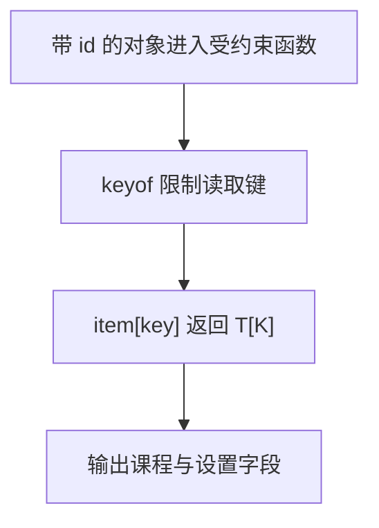

# Day 16：泛型约束、keyof、T[K] 与 typeof

预计用时：75–90 分钟。

普通泛型只能使用所有类型都具备的能力。今天学习声明“至少要有什么属性”，并从已有对象安全地取得键和值类型。

## 核心讲解

函数确实需要 `id` 时，把要求写进约束：

~~~ts
function describeId<Item extends { id: number }>(item: Item): string {
  return "ID=" + item.id;
}
~~~

这里的 `extends` 表示 `Item` 至少拥有数字 `id`，调用者仍可有更多属性。不要写成宽泛的 `object` 后再断言。

`keyof` 会从对象类型产生属性名联合。让键参数约束在这个联合中，再用索引访问类型描述返回值：

~~~ts
function getProperty<Item, Key extends keyof Item>(
  item: Item,
  key: Key,
): Item[Key] {
  return item[key];
}
~~~

具体 `Key` 决定具体返回类型，所以读取 `name` 得到字符串，读取 `age` 得到数字。`Item[keyof Item]` 会丢失这层精确关系。

类型位置的 `typeof` 可以从现有值取得静态类型：

~~~ts
const flags = { search: true, comments: false };
type FlagName = keyof typeof flags;
~~~

它不同于运行时 `typeof value`。`keyof` 和类型位置的 `typeof` 都不会产生可供输出的运行时值。

## 阅读示例

打开并右键运行 `example.ts`。观察 `getProperty(course, "title")` 和 `getProperty(course, "lessons")` 为什么有不同的返回类型。

## 函数变量追踪

对象和键分别进入 item 与 key 参数，item[key] 产生返回值。K 约束允许的键，T[K] 描述与键对应的返回类型；不要偷偷读取外部固定键。

## Example 代码流程图

运行 `example.ts` 前先沿图预测执行顺序；运行后再把每个节点对应到代码行。



## 独立练习导航

本日共有 2 道独立练习。每道题都有单独目录、说明、作答文件和解题结构；题目之间不共享代码。

| 目录 | 场景 | 类型 |
| --- | --- | --- |
| [practice01](./practice01/README.md) | 泛型约束、keyof、T[K] 与 typeof | 主任务 |
| [practice02](./practice02/README.md) | 安全读取配置字段 | 闭卷迁移 |

右击任意练习目录中的 `practice.ts` 即可单独检查；命令行也可运行 `npm run beginner -- day16 practice02`。

## 容易出错的地方

- 约束写成 `object`，却期待所有对象都有 `id`。
- 把 `keyof` 当成运行时的 `Object.keys`。
- 写 `key: string`，允许不存在的任意键。
- 返回 `Item[keyof Item]`，丢失具体键与值的关系。
- 混淆运行时与类型位置的 `typeof`。
- 用断言强迫外部字符串成为对象键。

### 错误代码示例

```ts
function getProperty<Item>(
  item: Item,
  key: string,
): Item[keyof Item] {
  return item[key]; // ❌ string 可能不是 Item 的键，而且返回值丢失了具体键关系。
}
```

### 正确写法

```ts
function getProperty<Item, Key extends keyof Item>(
  item: Item,
  key: Key,
): Item[Key] {
  return item[key]; // ✅ Key 只能取合法键，Item[Key] 保留该键对应的精确值类型。
}
```

## 拓展思考（不要求写代码）

如果键来自地址栏或输入框，它在运行时只是普通 `string`。在不使用类型断言的前提下，你需要做什么验证，才能安全地把它交给本题的 `getProperty`？

## 官方资料

- [Generics：Generic Constraints](https://www.typescriptlang.org/docs/handbook/2/generics.html#generic-constraints)
- [Keyof Type Operator](https://www.typescriptlang.org/docs/handbook/2/keyof-types.html)
- [Indexed Access Types](https://www.typescriptlang.org/docs/handbook/2/indexed-access-types.html)
