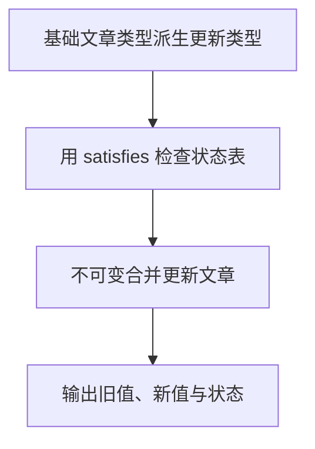

# Day 17：Utility Types、as const 与 satisfies

预计用时：75–90 分钟。

真实项目常常已经有可靠类型，我们只想从它派生“更新输入”“公开字段”或“键值表”，而不是复制一份几乎相同的定义。今天会用工具类型、`as const` 和 `satisfies` 建立一套不会轻易漂移的文章模型。

## 核心讲解

常用 Utility Types 会从已有类型生成新类型：

- `Partial<T>`：所有属性可选，适合补丁对象。
- `Required<T>`：所有属性必填。
- `Readonly<T>`：属性只读。
- `Pick<T, Keys>`：只挑选指定属性。
- `Omit<T, Keys>`：排除指定属性。
- `Record<Keys, Value>`：每个指定键对应同一种值。
- `ReturnType<typeof fn>`：取得函数返回类型。
- `Awaited<PromiseType>`：取得等待后的结果类型。

它们只改变静态描述，不会在运行时自动复制、冻结或删除字段。`Omit<Account, "email">` 不会让真实对象的 `email` 自动消失。

`as const` 会保留字面量并把数组推断为只读元组：

~~~ts
const levels = ["初级", "中级", "高级"] as const;
type Level = (typeof levels)[number];
~~~

`satisfies` 检查表达式符合目标类型，同时尽量保留表达式自身的精确推断：

~~~ts
const labels = {
  draft: "草稿",
  published: "已发布",
} satisfies Record<Status, string>;
~~~

与强制断言相比，漏键、拼错键和值类型错误都能得到提示。它仍然只是编译期检查，不能验证网络返回的未知数据。

## 阅读示例

打开并右键运行 `example.ts`。指出 `ArticlePatch`、`ArticlePreview`、`Status` 与 `statusLabels` 分别由哪个已有类型或值派生。

## Example 代码流程图

运行 `example.ts` 前先沿图预测执行顺序；运行后再把每个节点对应到代码行。



## 独立练习导航

本日共有 2 道独立练习。每道题都有单独目录、说明、作答文件和解题结构；题目之间不共享代码。

| 目录 | 场景 | 类型 |
| --- | --- | --- |
| [practice01](./practice01/README.md) | Utility Types、as const 与 satisfies | 主任务 |
| [practice02](./practice02/README.md) | 内容发布配置 | 闭卷迁移 |

右击任意练习目录中的 `practice.ts` 即可单独检查；命令行也可运行 `npm run beginner -- day17 practice02`。

## 容易出错的地方

- 复制新接口，原类型改变后忘记同步。
- 认为 `Omit` 会删除运行时字段。
- 使用 `Partial` 后直接修改原对象。
- 把 `as const` 当作运行时深冻结。
- 用 `as Record<...>` 掩盖漏键，而不是使用 `satisfies`。
- 派生数组成员联合时忘记 `[number]`。

### 错误代码示例

```ts
type PublicArticle = Omit<Article, "summary">;
const publicArticle: PublicArticle = article;
// ❌ 类型允许赋值不代表运行时删除了 summary；对象里仍然有这个字段。

const labels = {
  draft: "草稿",
} as Record<Status, string>; // ❌ 断言掩盖了 published、archived 等漏键。
```

### 正确写法

```ts
const { summary: _privateSummary, ...publicArticle } = article;
// ✅ 解构 rest 真正在运行时创建不含 summary 的对象。

const labels = {
  draft: "草稿",
  published: "已发布",
  archived: "已归档",
} satisfies Record<Status, string>; // ✅ 漏键或值类型错误都会被检查。
```

## 拓展思考（不要求写代码）

如果 `Article` 增加状态 `scheduled`，你希望哪些派生类型或配置自动更新，哪些位置应该立即报错提醒补充业务内容？为什么？

## 官方资料

- [Utility Types](https://www.typescriptlang.org/docs/handbook/utility-types.html)
- [TypeScript 3.4：const assertions](https://www.typescriptlang.org/docs/handbook/release-notes/typescript-3-4.html#const-assertions)
- [TypeScript 4.9：satisfies](https://www.typescriptlang.org/docs/handbook/release-notes/typescript-4-9.html#the-satisfies-operator)
