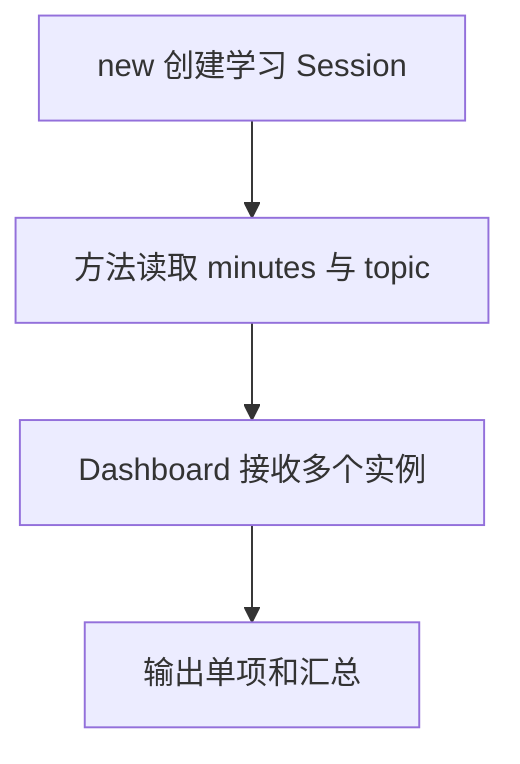

# Day 18：类——把数据与行为放在一起

预计用时：60–90 分钟。

普通对象和函数能解决很多问题。类适合“需要创建多个同类实例，而且每个实例长期保存自己的状态”的场景。今天会把字段、构造器、方法、可见性、接口、组合和 `this` 放进一个小型学习面板。

## 核心讲解

最小的有状态类：

~~~ts
class Counter {
  private count = 0;

  constructor(public readonly name: string) {}

  increment(): void {
    this.count += 1;
  }

  getCount(): number {
    return this.count;
  }
}
~~~

每次 `new Counter(...)` 都创建独立实例。方法通过 `this` 访问当前实例；`private` 限制 TypeScript 代码从外部访问，`readonly` 防止重新赋值，但它们都不是数据加密。

`implements` 只检查类是否符合接口，不会复制接口实现。一个面板需要摘要能力时，可以接收 `SummaryProvider`，而不是继承某个具体计数器。这叫组合：类使用另一个对象的能力，关系通常比深层继承清楚。

普通方法脱离实例单独调用时可能丢失 `this`。箭头函数字段会捕获创建实例时的 `this`：

~~~ts
format = (message: string): string => {
  return `${this.prefix} ${message}`;
};
~~~

`class` 在运行时真实存在；`type` 和 `interface` 编译后会消失。

## 阅读示例

打开并右键运行 `example.ts`。观察两个 `StudyCounter` 实例为什么保存不同分钟数，以及 `Dashboard` 为什么不需要继承计数器。

## 函数变量追踪

方法调用有两类输入：点号左边的实例成为 this，圆括号内的实参进入普通参数。方法可更新 this 字段，局部变量仍只属于本次调用。

## Example 代码流程图

运行 `example.ts` 前先沿图预测执行顺序；运行后再把每个节点对应到代码行。



## 独立练习导航

本日共有 2 道独立练习。每道题都有单独目录、说明、作答文件和解题结构；题目之间不共享代码。

| 目录 | 场景 | 类型 |
| --- | --- | --- |
| [practice01](./practice01/README.md) | 类：把数据与行为放在一起 | 主任务 |
| [practice02](./practice02/README.md) | 学习时段类 | 闭卷迁移 |

右击任意练习目录中的 `practice.ts` 即可单独检查；命令行也可运行 `npm run beginner -- day18 practice02`。

## 容易出错的地方

- 方法里写 `minutes` 而不是 `this.minutes`。
- 误以为 `private` 会加密或冻结数据。
- 把普通方法单独传递，调用时丢失 `this`。
- 误以为 `implements` 会自动提供方法实现。
- 为“拥有/使用”关系建立很深的继承层级。

### 错误代码示例

```ts
class MessageFormatter {
  constructor(private readonly prefix: string) {}

  format(message: string): string {
    return `${this.prefix} ${message}`;
  }
}

const format = new MessageFormatter("[学习]").format;
format("完成"); // ❌ 普通方法脱离实例后，this 不再指向原对象。
```

### 正确写法

```ts
class MessageFormatter {
  constructor(private readonly prefix: string) {}

  format = (message: string): string => {
    return `${this.prefix} ${message}`; // ✅ 箭头函数字段捕获当前实例的 this。
  };
}

const format = new MessageFormatter("[学习]").format;
format("完成");
```

## 拓展思考（不要求写代码）

一个只保存姓名和邮箱、没有长期内部行为的 `Profile` 是否值得写成类？请从实例状态、行为、测试难度和代码复杂度四方面比较“类型加普通函数”与“类”。

## 官方资料

- [Classes](https://www.typescriptlang.org/docs/handbook/2/classes.html)
- [Object Types](https://www.typescriptlang.org/docs/handbook/2/objects.html)
