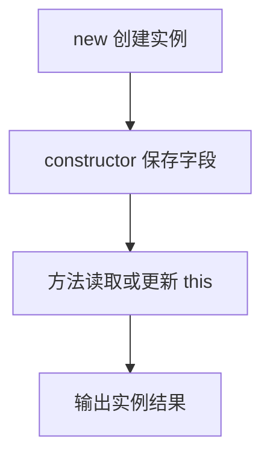

# DAY18 · Practice 01：类：把数据与行为放在一起

[返回当天课程](../README.md)

这是一道完整、独立的主练习。不要导入其他 practice 文件夹中的代码。

## 代码流程图

请从头编写“学习计数与面板”：

- 接口 `SummaryProvider`，包含 `summary(): string`。
- 类 `StudyCounter implements SummaryProvider`：
  - 私有字段 `minutes` 初始为 0。
  - 构造器参数属性 `public readonly topic: string`。
  - `add(minutes): void` 只累加大于 0 的分钟数。
  - `summary(): string` 返回 `主题: 分钟 minutes`。
- 类 `Dashboard`：
  - 构造器接收并保存 `private readonly provider: SummaryProvider`。
  - `render()` 返回 `Dashboard | 摘要`。
- 类 `MessageFormatter`：
  - 构造器保存 `private readonly prefix: string`。
  - `format` 必须是箭头函数字段，返回 `前缀 消息`，保证它脱离实例调用时仍有正确的 `this`。

固定操作：

- 创建 `TypeScript` 和 `Modules` 两个计数器。
- 前者依次增加 30、15 和 -5，后者增加 20。
- 用前者创建面板。
- 用前缀 `[学习]` 创建格式器，把 `format` 赋给 `detachedFormat` 后再调用。

精确输出：

~~~text
TypeScript: 45 minutes
Modules: 20 minutes
Dashboard | TypeScript: 45 minutes
[学习] 完成复习
~~~

限制：

- 不得使用 `any`、类型断言或直接从类外访问 `minutes`。
- 两个计数器必须是独立实例，不能共享全局分钟数。
- `Dashboard` 必须依赖接口并使用组合，不能继承 `StudyCounter`。
- `MessageFormatter.format` 必须能作为独立回调使用，不能在调用处手工绑定。
- 所有计算方法用 `return` 交付文字，最后才统一输出。

完成标准：右键运行后显示 PASS；能解释 `implements`、组合和箭头函数字段分别解决什么问题。

## 本题易漏语法

类字段与方法在 class 花括号内；字段语句用分号，方法关闭花括号后通常不加分号。

## 文件

- 在 `practice.ts` 中独立作答。
- 完成并运行通过后，再查看 `solution.ts` 的 TODO 解题结构与 `SOLUTION.md` 的结构提示。
