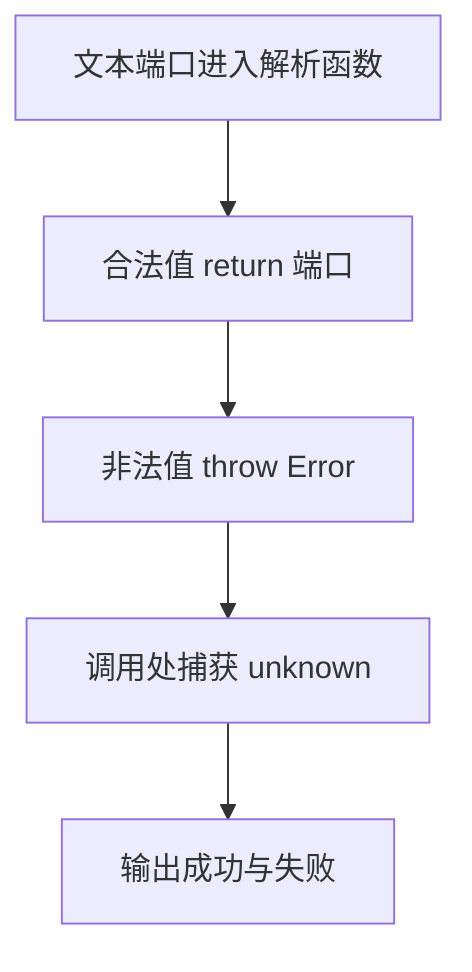

# Day 19：错误不是字符串——throw、unknown 与 Result

预计用时：60–90 分钟。

失败不是一个模糊的“没成功”。有些失败让当前函数无法继续，适合抛出 `Error`；有些是调用者经常要处理的业务结果，适合返回判别联合。今天会在一个端口配置流程中同时使用两种通道。

## 核心讲解

无法交付可信正常结果时，可以抛出标准错误对象：

~~~ts
function requirePositive(value: number): number {
  if (value <= 0) {
    throw new RangeError("数值必须大于 0");
  }
  return value;
}
~~~

`throw` 会中断当前路径，直到有边界使用 `try/catch`。任何 JavaScript 值理论上都可能被抛出，因此捕获值应先作为 `unknown`，收窄后再读取：

~~~ts
function errorMessage(error: unknown): string {
  return error instanceof Error ? error.message : "未知错误";
}
~~~

不要抛字符串、不要用 `any` 直接读属性，也不要用空 `catch {}` 吞掉失败。

如果失败是普通业务分支，可以返回结果联合：

~~~ts
type Result<T> =
  | { ok: true; value: T }
  | { ok: false; error: string };
~~~

检查 `result.ok` 后，TypeScript 会知道当前能读取 `value` 还是 `error`。关键不是所有地方统一选择一种风格，而是让失败通道清楚、信息不丢失。

## 阅读示例

打开并右键运行 `example.ts`。区分 `parsePort` 抛出的异常与 `savePort` 返回的失败结果，并找出捕获 `unknown` 的边界。

## 函数变量追踪

成功路径通过 return 交回值；失败路径通过 throw 中断函数，直到外层 catch 接住 error。catch 中的 error 是新的局部变量，并保持 unknown 直到收窄。

## Example 代码流程图

运行 `example.ts` 前先沿图预测执行顺序；运行后再把每个节点对应到代码行。



## 独立练习导航

本日共有 2 道独立练习。每道题都有单独目录、说明、作答文件和解题结构；题目之间不共享代码。

| 目录 | 场景 | 类型 |
| --- | --- | --- |
| [practice01](./practice01/README.md) | 错误不是字符串：throw、unknown 与 Result | 主任务 |
| [practice02](./practice02/README.md) | 端口配置校验 | 闭卷迁移 |

右击任意练习目录中的 `practice.ts` 即可单独检查；命令行也可运行 `npm run beginner -- day19 practice02`。

## 容易出错的地方

- `throw "bad"`，丢失标准错误信息和堆栈。
- 把捕获值写成 `any`，直接读取任意属性。
- 捕获后返回看似正常的假数据，调用者无法分辨失败。
- 未检查 `Number` 得到的 `NaN`、小数或越界值。
- 底层与上层重复输出同一错误。

### 错误代码示例

```ts
try {
  throw "端口错误"; // ❌ 抛字符串没有标准 Error 的名称和堆栈信息。
} catch (error: any) {
  console.log(error.message); // ❌ any 允许读取并不存在的属性，结果可能是 undefined。
}
```

### 正确写法

```ts
try {
  throw new RangeError("端口错误"); // ✅ 抛出标准错误对象并保留堆栈。
} catch (error: unknown) {
  // ✅ 捕获值先保持 unknown，经过真实检查后再读取 message。
  const message = error instanceof Error ? error.message : "未知错误";
  console.log(message);
}
```

## 拓展思考（不要求写代码）

如果保存端口要访问网络，临时断网、端口已占用和程序内部 bug 分别更适合“重试结果”“业务 Result”还是“异常”？请给出你的分类理由。

## 官方资料

- [Narrowing：instanceof](https://www.typescriptlang.org/docs/handbook/2/narrowing.html#instanceof-narrowing)
- [TSConfig：useUnknownInCatchVariables](https://www.typescriptlang.org/tsconfig/useUnknownInCatchVariables.html)
