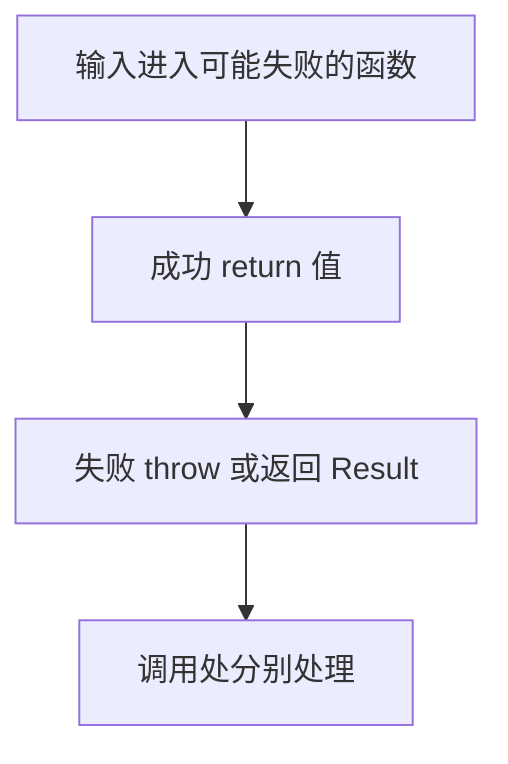

# DAY19 · Practice 01：错误不是字符串：throw、unknown 与 Result

[返回当天课程](../README.md)

这是一道完整、独立的主练习。不要导入其他 practice 文件夹中的代码。

## 代码流程图

请从头编写“端口解析与保存器”。

必须创建：

- 泛型判别联合 `Result<T>`，成功成员为 `{ ok: true; value: T }`，失败成员为 `{ ok: false; error: string }`。
- `parsePort(text: string): number`：使用 `Number` 转换；若结果不是 1 到 65535 的整数，抛出 `RangeError("端口必须是 1 到 65535 的整数")`。
- `savePort(port: number): Result<number>`：端口为 13 时返回失败 `端口 13 不可用`，其他端口返回成功值。
- `errorMessage(error: unknown): string`：`Error` 实例返回 `message`，否则返回“未知错误”。
- 固定输入 `inputs = ["3000", "13", "abc"]`。

逐项处理：先解析，再保存；保存失败是普通结果，不要抛异常。解析失败在外层捕获。精确输出：

~~~text
已保存端口：3000
保存失败：端口 13 不可用
解析失败：端口必须是 1 到 65535 的整数
~~~

限制：

- 不得使用 `any`、类型断言、抛字符串或空 `catch`。
- `parsePort` 必须验证整数与范围，非法时不得返回伪造默认值。
- `savePort` 不得为预期的端口占用抛异常。
- `catch` 参数保持 `unknown`，只通过 `errorMessage` 安全取得文字。
- 成功与失败分支必须通过 `ok` 收窄，不能用非空断言读取字段。

完成标准：右键运行后显示 PASS；能说明为什么“格式非法”和“端口不可用”选择了不同失败通道。

## 本题易漏语法

throw new Error(message); 抛出，catch (error) 接住；unknown 必须先收窄。

## 文件

- 在 `practice.ts` 中独立作答。
- 完成并运行通过后，再查看 `solution.ts` 的 TODO 解题结构与 `SOLUTION.md` 的结构提示。
