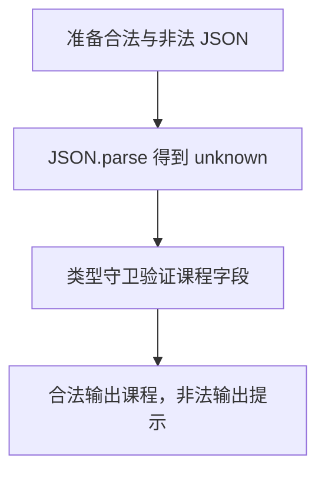

# Day 20：JSON 进入程序后，先把它当作 unknown

预计用时：75–90 分钟。

接口、文件和浏览器存储里的 JSON 即使“长得像”某个类型，也没有经过 TypeScript 检查。类型在运行后会被擦除，所以边界数据必须先作为 `unknown`，通过真实检查后才能进入业务代码。

## 核心讲解

正确顺序是：

1. 解析 JSON，并把结果放进 `unknown`。
2. 在运行时逐层验证。
3. 验证成功后，才把它当作业务类型使用。

`JSON.parse(raw) as User` 会跳过第二步。断言不会转换字符串，也不会补齐缺失字段。

类型谓词把真实检查结果告诉 TypeScript：

~~~ts
function isCourse(value: unknown): value is Course {
  return (
    typeof value === "object" &&
    value !== null &&
    "title" in value &&
    typeof value.title === "string"
  );
}
~~~

必须记住 `typeof null === "object"`，所以对象检查要排除 `null`。嵌套对象要逐层检查；数组不仅要用 `Array.isArray`，还要用 `every` 验证每个元素。谓词的承诺不能比实际检查更乐观。

JSON 语法错误发生在解析阶段；结构错误发生在解析成功之后。用结果联合保留这两种原因，调用者就能给出更准确的提示。

## 阅读示例

打开并右键运行 `example.ts`。逐个指出 `isCourse` 对外层对象、`null`、属性存在和属性类型做了哪些检查。

## Example 代码流程图

运行 `example.ts` 前先沿图预测执行顺序；运行后再把每个节点对应到代码行。



## 独立练习导航

本日共有 2 道独立练习。每道题都有单独目录、说明、作答文件和解题结构；题目之间不共享代码。

| 目录 | 场景 | 类型 |
| --- | --- | --- |
| [practice01](./practice01/README.md) | JSON、unknown 与运行时验证 | 主任务 |
| [practice02](./practice02/README.md) | 课程 JSON 验证 | 闭卷迁移 |

右击任意练习目录中的 `practice.ts` 即可单独检查；命令行也可运行 `npm run beginner -- day20 practice02`。

## 容易出错的地方

- 只检查最外层对象就相信内部字段。
- 忘记排除 `null`。
- 数组只检查 `Array.isArray`，没有检查元素。
- 谓词声明 `value is Profile`，实际却漏查字段。
- 用 `as` 让编译器安静，却没有改变真实数据。
- 用一个大 `catch` 混淆语法错误与结构错误。

### 错误代码示例

```ts
const profile = JSON.parse(raw) as Profile;
console.log(profile.contact.email.toLowerCase());
// ❌ as Profile 没有验证 contact 或 email，真实数据缺字段时仍会崩溃。

function isProfile(value: unknown): value is Profile {
  return typeof value === "object"; // ❌ null 也满足，而且完全没检查嵌套字段。
}
```

### 正确写法

```ts
function isProfile(value: unknown): value is Profile {
  return (
    isRecord(value) &&
    typeof value.name === "string" &&
    isRecord(value.contact) &&
    typeof value.contact.email === "string" &&
    Array.isArray(value.lessons) &&
    value.lessons.every(isLesson) // ✅ 数组中的每个元素也必须通过验证。
  );
}

const value: unknown = JSON.parse(raw);
if (isProfile(value)) {
  console.log(value.contact.email.toLowerCase()); // ✅ 收窄后再进入业务逻辑。
}
```

## 拓展思考（不要求写代码）

如果 `Profile` 新增可选 `nickname?: string`，验证器应怎样区分“字段完全缺席”“字段存在且为字符串”和“字段存在但类型错误”？

## 官方资料

- [TypeScript Handbook：Narrowing](https://www.typescriptlang.org/docs/handbook/2/narrowing.html)
- [Everyday Types：Type Assertions](https://www.typescriptlang.org/docs/handbook/2/everyday-types.html#type-assertions)
