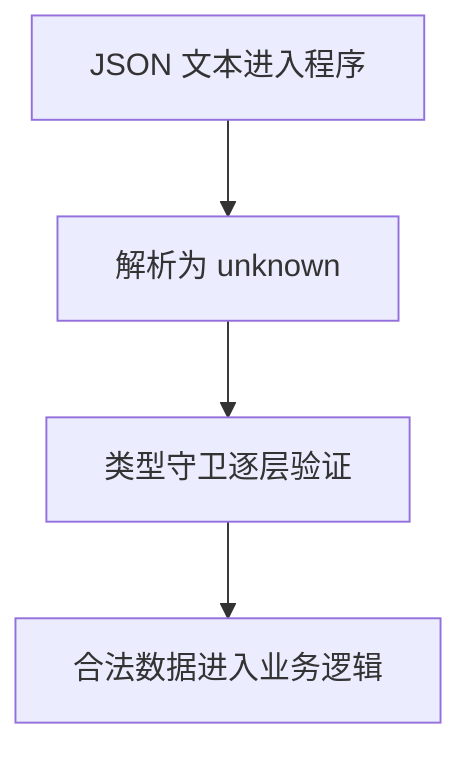

# DAY20 · Practice 01：JSON、unknown 与运行时验证

[返回当天课程](../README.md)

这是一道完整、独立的主练习。不要导入其他 practice 文件夹中的代码。

## 代码流程图

请从头编写“课程资料 JSON 验证器”。

业务类型：

- `Lesson`：`title: string`、`completed: boolean`
- `Profile`：`name: string`、`contact: { email: string }`、`lessons: Lesson[]`
- `ParseResult<T>`：成功 `{ ok: true; value: T }`，失败 `{ ok: false; error: string }`

必须实现：

- `isRecord(value: unknown): value is Record<string, unknown>`：确认非 `null` 对象。
- `isLesson(value: unknown): value is Lesson`。
- `isProfile(value: unknown): value is Profile`：逐层验证 name、contact.email、lessons 数组及每个元素。
- `parseProfile(raw: string): ParseResult<Profile>`：
  - JSON 语法错误返回 `JSON 格式错误`
  - 结构不合格返回 `资料字段无效`
  - 验证成功返回安全的 `Profile`

固定输入 `rawProfiles` 必须依次包含：

~~~text
{"name":"Ada","contact":{"email":"ada@example.com"},"lessons":[{"title":"变量","completed":true},{"title":"联合","completed":false}]}
{"name":"Lin","contact":{"email":123},"lessons":[]}
{"name":
~~~

遍历结果并精确输出：

~~~text
资料：Ada / ada@example.com / 课程：变量、联合 / 已完成：1
失败：资料字段无效
失败：JSON 格式错误
~~~

限制：

- 不得使用 `any`、类型断言、非空断言或 `as Profile`。
- 每个类型谓词的检查必须与承诺完全一致。
- JSON 解析结果必须先存为 `unknown`。
- `contact` 必须单独确认是非空对象；`lessons` 必须检查数组中的每一项。
- 只捕获 `JSON.parse` 的语法失败，不能把字段错误混成同一原因。

完成标准：右键运行后显示 PASS；能解释“编译通过”为什么不代表外部数据可信。

## 本题易漏语法

JSON.parse 接收字符串，结果先当 unknown；验证对象要先排除 null，因为 typeof null 也是 object。

## 文件

- 在 `practice.ts` 中独立作答。
- 完成并运行通过后，再查看 `solution.ts` 的 TODO 解题结构与 `SOLUTION.md` 的结构提示。
