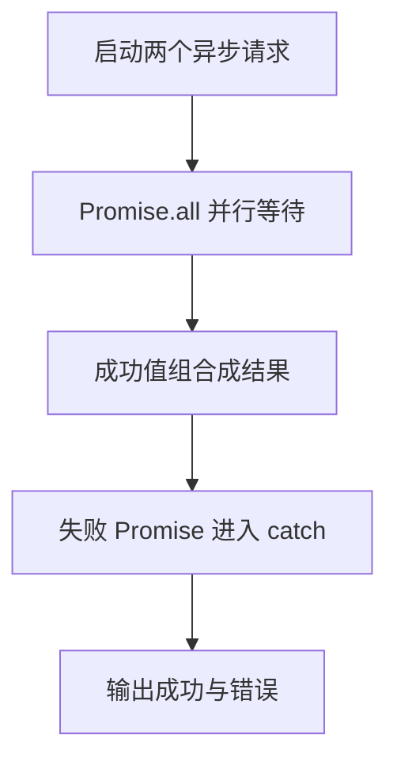

# Day 21：Promise、async/await 与异步错误

预计用时：60–90 分钟。

网络请求、定时器和文件读取不会立刻给出结果。JavaScript 用 `Promise` 表示“未来会成功或失败的结果”，`async/await` 让异步步骤更接近从上到下的阅读顺序。

## 核心讲解

`Promise<string>` 是“未来的字符串”，不是字符串本身。`await getName()` 才取得成功值；如果 Promise 失败，`await` 会像同步 `throw` 一样进入 `catch`。`async` 函数总是返回 Promise，因此其返回类型常写成 `Promise<T>`。

互不依赖的任务可以一起创建，再统一等待：

~~~ts
const [lesson, progress] = await Promise.all([
  loadLesson(),
  loadProgress(),
]);
~~~

不要写无人等待的 `forEach(async () => ...)`。`forEach` 不会收集回调返回的 Promise；应使用 `map` 产生 Promise 数组，再交给 `Promise.all`。

调用异步函数后必须明确 `await`、`return` 或保存并统一等待。捕获异步错误时，错误值仍是 `unknown`，先用 `instanceof Error` 收窄。不要在 `catch` 中返回看似成功的假数据，除非产品明确要求且结果能标记为备用数据。

## 阅读示例

打开并右键运行 `example.ts`。画出 `Promise.all` 的成功路径和通知请求的失败路径，并指出每个 `await` 后变量的类型。

## 函数变量追踪

调用 async 函数先得到 Promise；函数内部 return 的 T 会成为 Promise<T> 的成功值；调用处 await 后才得到 T。异常会让 Promise 拒绝并沿 await 进入 catch。

## Example 代码流程图

运行 `example.ts` 前先沿图预测执行顺序；运行后再把每个节点对应到代码行。



## 独立练习导航

本日共有 2 道独立练习。每道题都有单独目录、说明、作答文件和解题结构；题目之间不共享代码。

| 目录 | 场景 | 类型 |
| --- | --- | --- |
| [practice01](./practice01/README.md) | Promise、async/await 与异步错误 | 主任务 |
| [practice02](./practice02/README.md) | 并行内容加载 | 闭卷迁移 |

右击任意练习目录中的 `practice.ts` 即可单独检查；命令行也可运行 `npm run beginner -- day21 practice02`。

## 容易出错的地方

- 把 `Promise<string>` 直接当成 `string`。
- 互不依赖的请求仍逐个等待，造成不必要串行。
- 认为 `forEach` 会等待 async 回调。
- 调用 async 函数却既不等待也不返回。
- 捕获后返回假数据，把失败伪装成成功。
- 忘记 `await` 也会把拒绝重新抛出。

### 错误代码示例

```ts
const lesson: string = fetchText("课程");
// ❌ async 函数返回 Promise<string>，不是已经完成的 string。

["课程", "进度"].forEach(async (name) => {
  await fetchText(name);
});
console.log("全部完成"); // ❌ forEach 不收集 Promise，这一行会提前执行。
```

### 正确写法

```ts
const lesson: string = await fetchText("课程"); // ✅ await 后才得到成功值。

const requests = ["课程", "进度"].map((name) => fetchText(name));
await Promise.all(requests); // ✅ map 收集所有 Promise，再统一等待。
console.log("全部完成");
```

## 拓展思考（不要求写代码）

如果第二个请求必须使用第一个请求返回的课程 id，它们还能放进同一个 `Promise.all` 吗？请画出依赖顺序，并指出哪些请求仍可能并行。

## 官方资料

- [MDN：async function](https://developer.mozilla.org/docs/Web/JavaScript/Reference/Statements/async_function)
- [MDN：Promise.all](https://developer.mozilla.org/docs/Web/JavaScript/Reference/Global_Objects/Promise/all)
