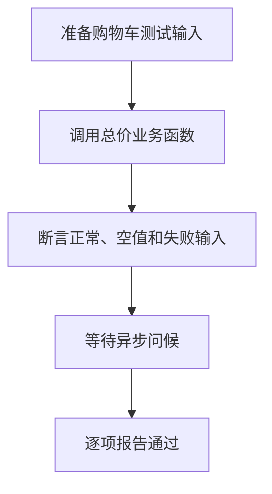

# Day 22｜测试与调试：让错误更早、更小地出现

类型检查回答“代码的类型能否成立”，运行测试回答“业务结果是否符合要求”。今天不再修补四个半成品，而是从空文件写出一个小功能和完整测试，亲手走完 Arrange–Act–Assert（AAA）。

建议用时：60–90 分钟。

## 今天会学到

- 用 Arrange、Act、Assert 组织测试；
- 分别覆盖正常、边界和错误路径；
- 让业务函数 `return` 可断言的值，而不是只打印；
- 测试同步抛错，并在异步测试中先 `await`；
- 从第一条失败信息和最小输入开始调试。

## 核心讲解

一条测试只验证一个清楚的行为：先准备输入（Arrange），再调用函数（Act），最后比较实际值与期望值（Assert）。正常输入通过不代表边界也正确；编译通过也不代表平均分公式符合需求。

业务函数应返回结果，输出留给调用层或测试层。异步函数返回的是 `Promise<T>`，必须先 `await` 得到 `T`，再做断言。测试抛错时还要防止把“测试自身的失败错误”误当成被测函数成功抛错。

## 函数变量追踪

可测试函数让输入从参数进入、结果从 return 出去。测试把实参传入，接住实际结果并与期望比较；只有 console.log 而没有稳定返回值的函数难以断言。

## Example 代码流程图

运行 `example.ts` 前先沿图预测执行顺序；运行后再把每个节点对应到代码行。



## 独立练习导航

本日共有 2 道独立练习。每道题都有单独目录、说明、作答文件和解题结构提示；题目之间不共享代码。

| 目录 | 场景 | 类型 |
| --- | --- | --- |
| [practice01](./practice01/README.md) | Day 22 · 独立测试与调试练习 | 主任务 |
| [practice02](./practice02/README.md) | 购物车回归测试 | 闭卷迁移 |

右击任意练习目录中的 `practice.ts` 即可单独检查；命令行也可运行 `npm run beginner -- day22 practice02`。

## 最容易踩的坑

- 把 `console.log` 当成返回值；
- 只测一个正常输入；
- `assertThrows` 捕获到自己抛出的测试失败；
- 直接比较 Promise，而没有先 `await`；
- 一条测试同时验证许多不相关行为。

### 错误代码示例

```ts
function assertThrows(action: () => void): void {
  try {
    action();
    throw new Error("被测函数没有抛错");
  } catch {
    // ❌ 这里也会捕获上一行由测试自己抛出的 Error，造成“假通过”。
    console.log("测试通过");
  }
}

const actual = greeting("小夏");
// ❌ actual 是 Promise<string>，还不是最终的问候字符串。
console.log(actual === "你好，小夏");
```

### 正确写法

```ts
function assertThrows(action: () => void): void {
  try {
    action();
  } catch (error: unknown) {
    if (error instanceof RangeError) {
      console.log("测试通过");
      return;
    }
    throw error;
  }

  // ✅ 只有被测函数完全没有抛错时，才由测试在 try 外报告失败。
  throw new Error("被测函数没有抛出预期的 RangeError");
}

// ✅ 先等待 Promise 完成，再断言解析后的 string。
const actual = await greeting("小夏");
console.log(actual === "你好，小夏");
```

## 拓展思考（不要求写代码）

如果 `loadScores()` 偶尔因为网络错误而拒绝 Promise，第五条测试应怎样区分“正确失败”和“意外失败”？请用 AAA 三步口述测试设计。

## 官方资料

- [TypeScript：静态类型检查](https://www.typescriptlang.org/docs/handbook/2/basic-types.html#static-type-checking)
- [Node.js：Test runner](https://nodejs.org/api/test.html)
