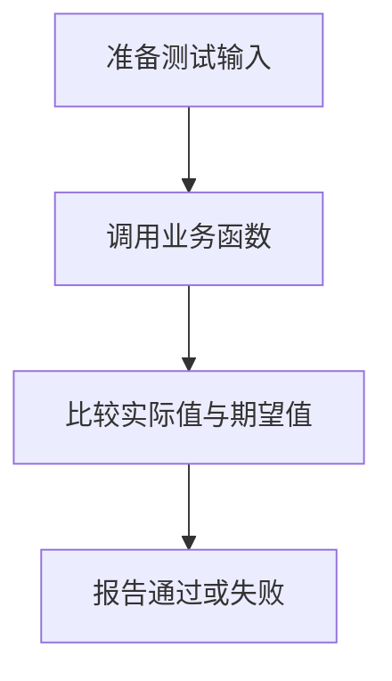

# DAY22 · Practice 01：Day 22 · 独立测试与调试练习

[返回当天课程](../README.md)

这是一道完整、独立的主练习。不要导入其他 practice 文件夹中的代码。

## 代码流程图



在 `practice.ts` 中从零完成“成绩平均值与测试”程序。

必须使用这些名称：`clampScore`、`averageScore`、`loadScores`、`assertEqual`、`assertThrows`、`testCount`。

需求：

1. `clampScore(score)` 把分数限制在 0–100。
2. `averageScore(scores)` 先限制每个分数，再返回平均值；空数组抛出消息为 `成绩列表不能为空` 的 `RangeError`。
3. `loadScores()` 是异步函数，返回 `[90, 70]`。
4. 自己写断言函数，并按 AAA 结构完成四条测试：普通平均分 `[20, 40, 60]` 得 40；越界分数 `[-10, 120]` 得 50；空数组抛错；异步成绩平均分得 80。
5. 每通过一条测试就把 `testCount` 加 1，最后输出总数。

精确输出：

```text
通过: 普通平均分
通过: 分数限制在 0 到 100
通过: 空列表会报错
通过: 异步成绩
共 4 个测试
```

限制：不使用 `any`、非空断言 `!` 或测试框架；业务函数内不要打印结果。

完成标准：右击运行 `practice.ts` 后输出完全一致；四条测试分别覆盖正常、边界、错误、异步路径；故意改错期望值时，测试必须失败而不是继续显示通过。

## 本题易漏语法

测试仍是实参进、返回值出；实际值与期望值作为不同实参，用逗号分开。

## 文件

- 在 `practice.ts` 中独立作答。
- 独立完成后，再查看 `solution.ts` 的 TODO 代码骨架与 `SOLUTION.md` 的解题结构；两者都不提供完整答案。
