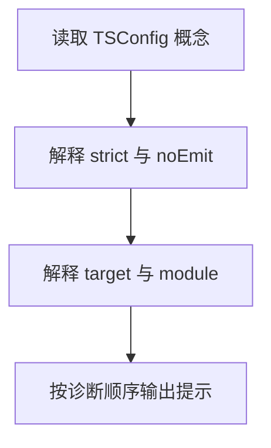

# Day 23｜读懂 TSConfig，也读懂第一条错误

`tsconfig.json` 决定 TypeScript 用哪些规则检查项目。今天从空文件写一个小程序，同时接受多项严格规则检查，练习把错误信息转化为明确分支。

建议用时：60–90 分钟。

## 今天会学到

- `strictNullChecks` 要求处理 `undefined` 和 `null`；
- `noImplicitAny` 要求参数有可解释的类型；
- `noUncheckedIndexedAccess` 提醒数组索引可能越界；
- `exactOptionalPropertyTypes` 区分“属性不存在”和“值为 undefined”；
- `target`、`module`、`noEmit` 的职责；
- 多条错误出现时先修第一条。

## 核心讲解

`target` 决定输出 JavaScript 的语法年代，`module` 决定 import/export 的模块规则，`noEmit` 表示只检查而不生成文件。它们都不能代替运行测试。

严格规则不是在刁难你，而是在强迫程序把缺失情况说清楚：`find` 可能找不到，`scores[0]` 可能不存在，可选属性可能根本没有这个键，`unknown` 必须先缩小类型才能参与计算。

读错误的顺序固定为：只看第一条 → 找行号和表达式 → 说清实际类型与需要类型 → 做最小修改 → 再检查。

## Example 代码流程图

运行 `example.ts` 前先沿图预测执行顺序；运行后再把每个节点对应到代码行。



## 独立练习导航

本日共有 2 道独立练习。每道题都有单独目录、说明、作答文件和解题结构提示；题目之间不共享代码。

| 目录 | 场景 | 类型 |
| --- | --- | --- |
| [practice01](./practice01/README.md) | Day 23 · 严格配置下的独立练习 | 主任务 |
| [practice02](./practice02/README.md) | 编译配置说明器 | 闭卷迁移 |

右击任意练习目录中的 `practice.ts` 即可单独检查；命令行也可运行 `npm run beginner -- day23 practice02`。

## 最容易踩的坑

- 用类型断言或非空断言压掉提示；
- 认为 `number[]` 的任意索引必然是数字；
- 对 `unknown` 直接做乘法；
- 用 `theme: undefined` 假装删除可选属性；
- 同时猜测多条错误，而没有先处理第一条。

### 错误代码示例

```ts
interface Preferences {
  theme?: "light" | "dark";
}

function double(value) {
  // ❌ value 隐式为 any；严格模式无法检查调用者传入了什么。
  return value * 2;
}

const scores: number[] = [];
const first: number = scores[0]; // ❌ 索引可能越界，结果可能是 undefined。

const preferences: Preferences = {
  theme: undefined, // ❌ exactOptionalPropertyTypes 下，这不等于“属性不存在”。
};
```

### 正确写法

```ts
interface Preferences {
  theme?: "light" | "dark";
}

function double(value: unknown): number | undefined {
  // ✅ unknown 必须先收窄，非数字输入得到明确的缺失结果。
  return typeof value === "number" ? value * 2 : undefined;
}

const scores: number[] = [];
const first = scores[0];
if (first !== undefined) {
  console.log(first.toFixed(1)); // ✅ 使用的正是刚刚检查过的变量。
}

const preferences: Preferences = { theme: "dark" };
const { theme: _removed, ...withoutTheme } = preferences;
// ✅ withoutTheme 中真正不存在 theme 这个键。
```

## 拓展思考（不要求写代码）

如果开启 `noUncheckedIndexedAccess` 后，一个已经检查过 `scores.length > 0` 的函数仍提示 `scores[0]` 可能缺失，你会选择怎样重写代码来让“存在性”更直接地被 TypeScript 看见？

## 官方资料

- [TSConfig：strict](https://www.typescriptlang.org/tsconfig/strict.html)
- [TSConfig：noUncheckedIndexedAccess](https://www.typescriptlang.org/tsconfig/noUncheckedIndexedAccess.html)
- [TSConfig：exactOptionalPropertyTypes](https://www.typescriptlang.org/tsconfig/exactOptionalPropertyTypes.html)
- [TSConfig 总览](https://www.typescriptlang.org/tsconfig)
