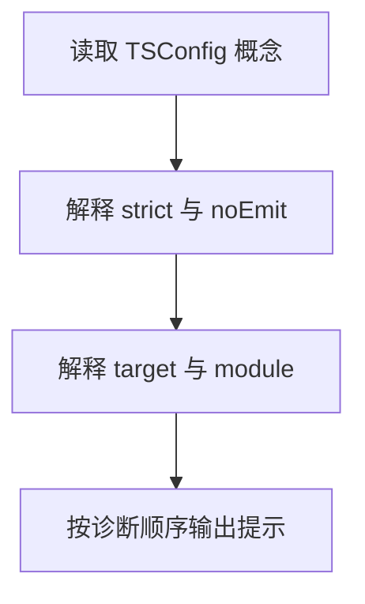

# DAY23 · Practice 02：编译配置说明器

[返回当天课程](../README.md)

这是一道与 Practice 01 文件完全分开的闭卷迁移题。先理解并运行当天 `example.ts`，然后关闭它；不要复制代码，仅根据下面的流程与输出从空白重新实现。

## 代码流程图



## 必须练到的能力

阅读严格 TSConfig，优先处理第一条根因错误，不关闭严格检查。

- 不得导入 `practice01` 或直接调用其他练习的实现。
- 输出必须由变量、计算或函数返回值产生，不把整行结果写死。
- 每个参数、局部变量和返回值都应能在流程图中找到位置。

## 精确期望输出

```text
先读: 第一条错误
strict: 开启一组严格检查
noEmit: 只检查，不生成文件
target/module: 输出语法 / 模块规则
```

## 文件

在本目录的 `practice.ts` 作答；独立完成后再查看 `solution.ts` 的 TODO 代码骨架与 `SOLUTION.md` 的解题结构；两者都不提供完整答案。
