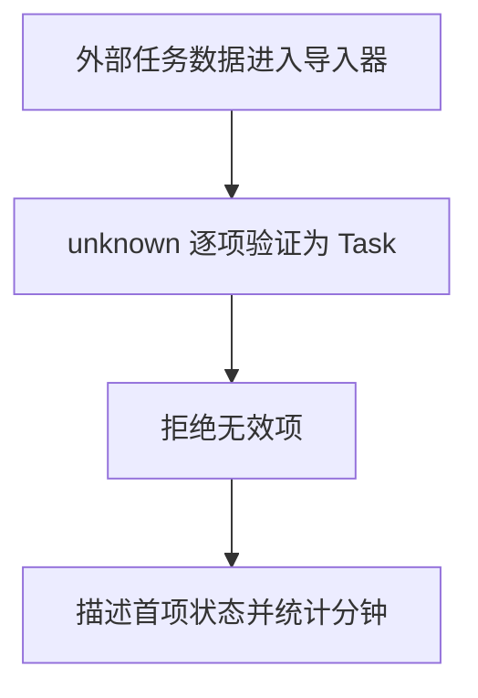

# Day 24｜结课项目（一）：模型与外部数据边界

结课项目“学习任务与进度报告器”从数据边界开始。今天要从空文件建立可靠模型，并把 JSON 解析结果当作 `unknown` 逐层验证，而不是用类型断言假装外部数据正确。

建议用时：60–90 分钟。

## 今天会学到

- 用判别联合表达待开始、进行中、已完成状态；
- 用类型谓词验证对象、嵌套状态和数组元素；
- 区分编译期类型与运行时数据；
- 保留有效任务并统计被拒绝的数据；
- 用完整 `switch` 安全读取不同状态的字段。

## 核心讲解

```text
JSON 文本 → JSON.parse → unknown → 逐层检查 → StudyTask[]
                                  ↘ 失败原因或拒绝数量
```

`type` 和 `interface` 编译后会消失，不能检查网络、文件或本地存储中的真实数据。对象检查必须同时排除 `null`；数组不仅要用 `Array.isArray`，还要验证每个元素。

状态应使用判别联合，而不是把所有时间字段都写成可选。这样 doing 必须携带 `startedAt`，done 必须同时携带开始与完成时间，不容易产生矛盾数据。

## Example 代码流程图

运行 `example.ts` 前先沿图预测执行顺序；运行后再把每个节点对应到代码行。



## 独立练习导航

本日共有 3 道独立练习。每道题都有单独目录、说明、作答文件和解题结构提示；题目之间不共享代码。

| 目录 | 场景 | 类型 |
| --- | --- | --- |
| [practice01](./practice01/README.md) | Day 24 · 结课项目（一）独立综合题 | 主任务 |
| [practice02](./practice02/README.md) | 任务导入边界 | 闭卷迁移 |
| [practice03](./practice03/README.md) | 订单 JSON 导入边界 | 综合应用 |

右击任意练习目录中的 `practice.ts` 即可单独检查；命令行也可运行 `npm run beginner -- day24 practice02`。

## 常见错误

- 写 `JSON.parse(text) as StudyTask[]`；
- 忘记 `typeof null === "object"`；
- 只检查 `Array.isArray`；
- 用 `status: string` 接受任意拼写。

### 错误代码示例

```ts
type StudyTask = {
  id: string;
  minutes: number;
  status: "todo" | "done";
};

const tasks = JSON.parse(text) as StudyTask[];
// ❌ 类型断言不会检查运行时数据；null、错误字段和错误状态都可能混进来。
console.log(tasks[0].minutes.toFixed(0));
```

### 正确写法

```ts
function isRecord(value: unknown): value is Record<string, unknown> {
  // ✅ typeof null 也是 "object"，所以必须先排除 null。
  return value !== null && typeof value === "object";
}

function isStudyTask(value: unknown): value is StudyTask {
  return (
    isRecord(value) &&
    typeof value.id === "string" &&
    typeof value.minutes === "number" &&
    Number.isFinite(value.minutes) &&
    (value.status === "todo" || value.status === "done")
  );
}

const parsed: unknown = JSON.parse(text);
// ✅ 数组外形和每一个元素都通过后，才得到可信的 StudyTask[]。
const tasks = Array.isArray(parsed) && parsed.every(isStudyTask) ? parsed : [];
```

## 拓展思考（不要求写代码）

如果新增 `{ status: "paused"; reason: string }`，模型、运行时验证器和 `describeState` 分别会在哪些位置提醒你补充逻辑？

## 官方资料

- [Narrowing](https://www.typescriptlang.org/docs/handbook/2/narrowing.html)
- [Everyday Types](https://www.typescriptlang.org/docs/handbook/2/everyday-types.html)
- [Type Declarations](https://www.typescriptlang.org/docs/handbook/2/type-declarations.html)
