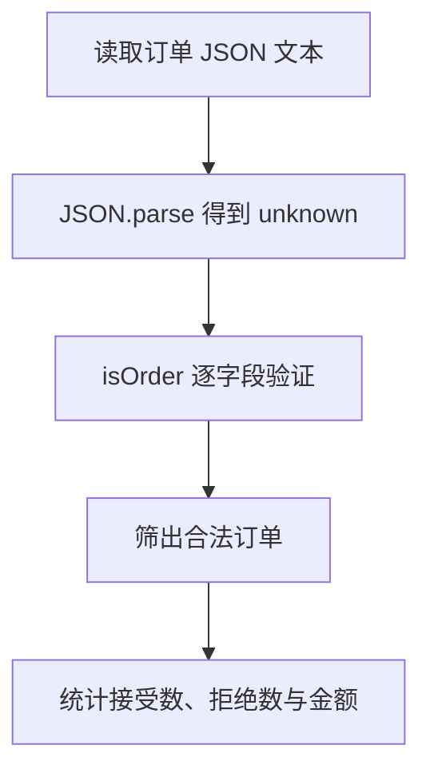

# DAY24 · Practice 03：订单 JSON 导入边界

[返回当天课程](../README.md)

从 unknown JSON 中筛出合法订单并统计金额，拒绝字段类型错误的数据。

## 代码流程图



## 要求

- 从空白文件完成本题需要的类型、函数、固定输入与输出。
- 不得导入其他 practice 文件夹。
- 计算必须来自参数和局部变量；函数用 return 交付结果。
- 保持原数据不变，并按流程图处理边界或状态。

## 精确期望输出

```text
Accepted orders: 2
Rejected orders: 1
Order total: 160
```

## 文件

在本目录的 `practice.ts` 作答；完成后再查看 `solution.ts` 的 TODO 代码骨架与 `SOLUTION.md` 的解题结构；两者都不提供完整答案。
