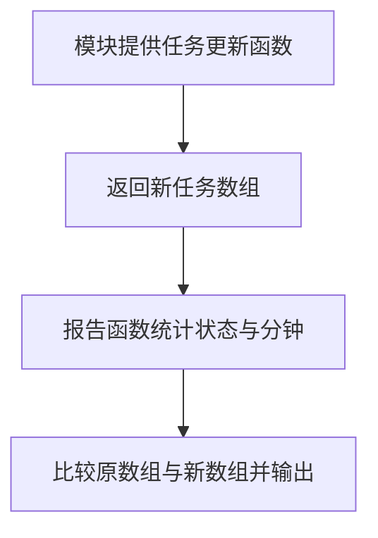

# Day 25｜结课项目（二）：业务逻辑、不可变更新与模块

昨天把外部数据变成了可信任务，今天从空文件实现更新、筛选、排序和统计。示例继续展示多模块组织；独立练习只写一个入口文件，让注意力集中在数据关系和不可变更新上。

建议用时：60–90 分钟。

## 今天会学到

- 用 `map` 和对象展开替换一个任务，不修改旧数据；
- 区分新数组、新对象与复用的旧引用；
- 避免 `sort` 原地修改调用者数组；
- 用 `Record` 保证每种状态都有统计位置；
- 用受约束泛型保留实体的具体类型。

## 核心讲解

`map` 创建新数组，命中项用对象展开创建新对象；未命中项没有变化，可以安全复用旧引用。对象展开是浅复制，嵌套可变对象仍共享引用。

`sort` 会原地修改数组，应先 `filter` 或复制再排序。`Record<TaskStatus, number>` 比任意字符串键严格：新增状态时会提醒补齐统计初值。

`T extends { readonly id: string }` 表示函数接受任意带 id 的实体，并让输入、更新回调和返回数组保持同一种 `T`。

## 函数变量追踪

业务函数把任务数组与操作参数作为输入，局部变量保存中间结果，return 新数组或统计值。原参数保持不变，调用处为每一步结果取新名称。

## Example 代码流程图

运行 `example.ts` 前先沿图预测执行顺序；运行后再把每个节点对应到代码行。



## 独立练习导航

本日共有 3 道独立练习。每道题都有单独目录、说明、作答文件和解题结构提示；题目之间不共享代码。

| 目录 | 场景 | 类型 |
| --- | --- | --- |
| [practice01](./practice01/README.md) | Day 25 · 结课项目（二）独立综合题 | 主任务 |
| [practice02](./practice02/README.md) | 任务更新与统计 | 闭卷迁移 |
| [practice03](./practice03/README.md) | 库存不可变更新 | 综合应用 |

右击任意练习目录中的 `practice.ts` 即可单独检查；命令行也可运行 `npm run beginner -- day25 practice02`。

## 常见错误

- 直接写 `task.status = "done"`；
- 对参数数组直接 `sort`；
- 误以为对象展开会深复制；
- 用任意字符串键统计状态。

### 错误代码示例

```ts
function completeFirst(tasks: StudyTask[]): StudyTask[] {
  tasks[0].status = "done"; // ❌ 修改了调用者持有的原任务对象。
  return tasks.sort((a, b) => a.minutes - b.minutes);
  // ❌ sort 还会原地重排调用者的原数组。
}
```

### 正确写法

```ts
function completeFirst(tasks: readonly StudyTask[]): StudyTask[] {
  const updated = tasks.map((task, index) =>
    // ✅ 命中项创建新对象；未命中项可以安全复用旧引用。
    index === 0 ? { ...task, status: "done" as const } : task
  );

  // ✅ updated 已是新数组；也可写 [...tasks].sort(...) 后再做其他处理。
  return updated.sort((a, b) => a.minutes - b.minutes);
}
```

## 拓展思考（不要求写代码）

如果任务新增可修改的 `details: { notes: string[] }`，更新其中一条 notes 时需要复制哪几层，才能保证旧任务完全不变？

## 官方资料

- [Object Types](https://www.typescriptlang.org/docs/handbook/2/objects.html)
- [Generics](https://www.typescriptlang.org/docs/handbook/2/generics.html)
- [Utility Types：Record](https://www.typescriptlang.org/docs/handbook/utility-types.html#recordkeys-type)
- [Modules](https://www.typescriptlang.org/docs/handbook/2/modules.html)
