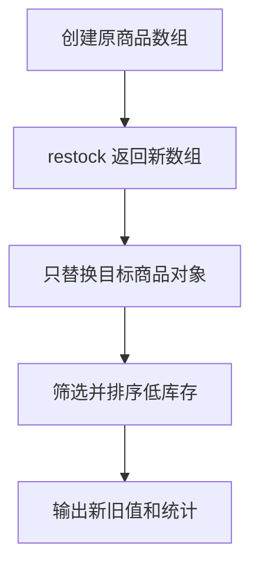

# DAY25 · Practice 03：库存不可变更新

[返回当天课程](../README.md)

通过纯函数补货，不修改原库存，再筛选低库存商品并统计总库存。

## 代码流程图



## 要求

- 从空白文件完成本题需要的类型、函数、固定输入与输出。
- 不得导入其他 practice 文件夹。
- 计算必须来自参数和局部变量；函数用 return 交付结果。
- 保持原数据不变，并按流程图处理边界或状态。

## 精确期望输出

```text
Original cable: 1
Updated cable: 6
Low stock: Mouse
Total stock: 16
```

## 文件

在本目录的 `practice.ts` 作答；完成后再查看 `solution.ts` 的 TODO 代码骨架与 `SOLUTION.md` 的解题结构；两者都不提供完整答案。
