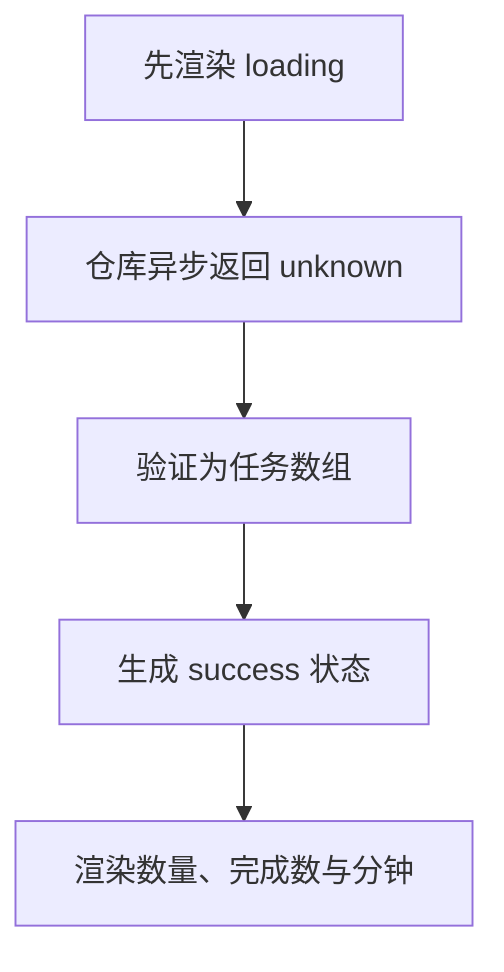

# Day 26｜结课项目（三）：异步加载、状态与测试

主线最后一天要把任务报告器接到异步仓库。你将从空文件写出外部数据验证、加载状态、错误收窄、渲染和四条回归测试，完成一条从 Promise 到界面的可靠数据流。

建议用时：60–90 分钟。

## 今天会学到

- 用 `await` 把 `Promise<T>` 变成最终的 `T`；
- 把仓库结果保留为 `unknown` 并运行时验证；
- 用判别联合表达 loading、success、failure；
- 在 `catch` 中把错误当作 `unknown` 收窄；
- 测试正常、空数组、坏数据和异步失败。

## 核心讲解

```text
TaskRepository.load() → Promise<unknown> → await → 运行时验证
                                            ├─ success：任务与总分钟
                                            └─ failure：可读错误消息
```

不要用 `isLoading`、`data?`、`error?` 三个可互相矛盾的字段。判别联合让每个状态只携带合法数据。异步不会让类型断言变成验证：网络或文件结果仍应从 `unknown` 开始。

`catch` 到的值不保证是 `Error`，要先用 `instanceof Error`。回归测试必须覆盖成功以外的路径，否则坏数据或离线错误可能直到真实使用时才暴露。

## 函数变量追踪

这里同时有 Promise 与状态两条数据流：调用得到 Promise，await 得到数据或抛错；成功/失败分支再 return 不同的判别联合成员。

## Example 代码流程图

运行 `example.ts` 前先沿图预测执行顺序；运行后再把每个节点对应到代码行。



## 独立练习导航

本日共有 3 道独立练习。每道题都有单独目录、说明、作答文件和解题结构提示；题目之间不共享代码。

| 目录 | 场景 | 类型 |
| --- | --- | --- |
| [practice01](./practice01/README.md) | Day 26 · 结课项目（三）独立综合题 | 主任务 |
| [practice02](./practice02/README.md) | 异步任务面板 | 闭卷迁移 |
| [practice03](./practice03/README.md) | 异步天气面板 | 综合应用 |

右击任意练习目录中的 `practice.ts` 即可单独检查；命令行也可运行 `npm run beginner -- day26 practice02`。

## 常见错误

- 忘记 `await`，把 Promise 当任务数组；
- 在 `catch` 里直接访问 `error.message`；
- 空数组被错误判为无效；
- 只测试成功路径；
- 用断言越过外部数据边界。

### 错误代码示例

```ts
async function loadDashboard(repository: TaskRepository): Promise<LoadState> {
  try {
    const tasks = repository.load() as unknown as StudyTask[];
    // ❌ 既忘了 await，又用双重断言绕过外部数据验证。
    if (!tasks.length) throw new Error("没有任务");
    // ❌ 合法的空数组被错误当成失败。
    return { status: "success", tasks, totalMinutes: 0 };
  } catch (error) {
    // ❌ catch 中的值可能是字符串、数字或其他对象，不一定有 message。
    return { status: "failure", message: error.message };
  }
}
```

### 正确写法

```ts
async function loadDashboard(repository: TaskRepository): Promise<LoadState> {
  try {
    // ✅ await 后仍是 unknown；异步完成不代表外部数据已经可信。
    const value: unknown = await repository.load();
    const tasks = parseTasks(value);
    if (tasks === null) {
      return { status: "failure", message: "Task data is invalid" };
    }

    // ✅ [] 能通过验证，并自然得到 totalMinutes = 0。
    const totalMinutes = tasks.reduce((sum, task) => sum + task.minutes, 0);
    return { status: "success", tasks, totalMinutes };
  } catch (error: unknown) {
    return {
      status: "failure",
      // ✅ 先收窄，再读取 Error 独有的 message。
      message: error instanceof Error ? error.message : "Unknown error",
    };
  }
}
```

## 拓展思考（不要求写代码）

如果面板还要从另一个独立仓库加载用户名，怎样用 `Promise.all` 并发等待两项数据？其中一项失败时，最终状态应如何定义才不会留下半成功的矛盾数据？

## 官方资料

- [Narrowing](https://www.typescriptlang.org/docs/handbook/2/narrowing.html)
- [Utility Types：Awaited](https://www.typescriptlang.org/docs/handbook/utility-types.html#awaitedtype)
- [Modules](https://www.typescriptlang.org/docs/handbook/2/modules.html)
