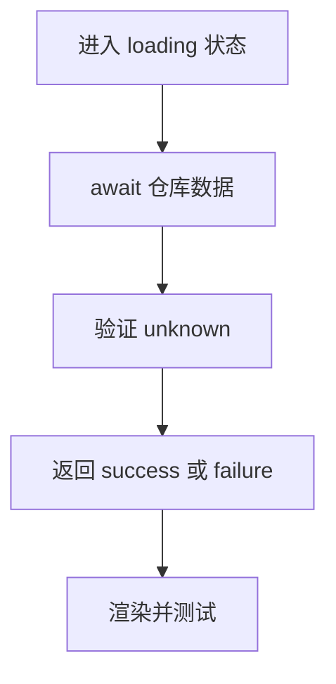

# DAY26 · Practice 01：Day 26 · 结课项目（三）独立综合题

[返回当天课程](../README.md)

这是一道完整、独立的主练习。不要导入其他 practice 文件夹中的代码。

## 代码流程图



在 `practice.ts` 中从零完成“异步任务面板”。

必须名称：`StudyTask`、`LoadState`、`TaskRepository`、`isRecord`、`isStudyTask`、`parseTasks`、`loadDashboard`、`render`、`MemoryTaskRepository`、`runRegressionTests`。

需求：

1. 任务字段为只读 id、title、非负有限 minutes、`todo | doing | done` 状态。
2. 仓库 `load()` 返回 `Promise<unknown>`；内存仓库可返回给定值，也可异步抛出给定错误。
3. `parseTasks` 验证数组及每个元素；空数组合法，坏数据返回 `null`。
4. `loadDashboard` 成功时计算总分钟，坏数据返回消息 `Task data is invalid`，捕获 Error 时保留其 message。
5. `render` 把 loading 和 success 转成输出行。
6. `runRegressionTests` 独立验证：正常两项、空数组、坏 minutes、仓库抛出 `offline`，返回通过数量。

固定正常任务为 Async / 30 / done 与 Tests / 45 / todo。

精确输出：

```text
State: loading
State: success
Tasks: 2
Done: 1
Minutes: 75
Tests passed: 4/4
```

限制：不使用 `any`、非空断言 `!` 或 `as StudyTask[]`；不能吞掉异常后伪装成成功。

完成标准：右击运行 `practice.ts` 后输出完全一致；四条测试确实检查结果，而不是无条件累加；能画出 Promise、unknown、验证器、LoadState 的顺序。

## 本题易漏语法

判别联合靠共同字段连接；对象值属性用逗号，类型联合成员用 |。

## 文件

- 在 `practice.ts` 中独立作答。
- 独立完成后，再查看 `solution.ts` 的 TODO 代码骨架与 `SOLUTION.md` 的解题结构；两者都不提供完整答案。
