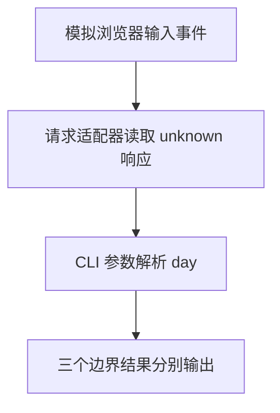

# Day 27（选修）｜浏览器、请求与命令行边界

TypeScript 总在某个运行环境中执行。浏览器提供 DOM、事件和 `fetch`，Node.js 提供命令行与文件系统。类型声明描述环境 API，却不会创造运行时能力；外部输入仍要验证。

建议用时：60–90 分钟。

## 今天会学到

- 用结构类型表达输入事件，并处理空目标；
- 把客户端响应保留为 `Promise<unknown>`；
- 把命令行参数解析成可测试的纯函数；
- 区分环境声明、运行时 API 与外部数据验证。

## 核心讲解

真实浏览器事件可用 `HTMLInputElement` 和 `event.currentTarget`，但课程在 Node 中运行，不能直接执行 `document`。独立练习用最小结构模拟事件，把可测试业务逻辑与真实 DOM 绑定分开。

请求客户端即使写成 TypeScript，也无法保证服务器响应。先 `await` 得到 `unknown`，再验证对象与字段。命令行解析也不要在业务函数内部读取全局 `process.argv`；让 `parseArgs(args)` 接收普通字符串数组，更容易测试。

## 函数变量追踪

边界适配函数把事件、响应或 CLI 参数转成普通值；纯业务函数只接收这些普通参数。这样变量来源清楚，也能用假数据单独测试。

## Example 代码流程图

运行 `example.ts` 前先沿图预测执行顺序；运行后再把每个节点对应到代码行。



## 独立练习导航

本日共有 2 道独立练习。每道题都有单独目录、说明、作答文件和解题结构提示；题目之间不共享代码。

| 目录 | 场景 | 类型 |
| --- | --- | --- |
| [practice01](./practice01/README.md) | Day 27 · 运行环境边界独立综合题 | 主任务 |
| [practice02](./practice02/README.md) | 搜索与命令行边界 | 闭卷迁移 |

右击任意练习目录中的 `practice.ts` 即可单独检查；命令行也可运行 `npm run beginner -- day27 practice02`。

## 常见错误

- 在 Node 中直接执行 `document.querySelector`；
- 把响应断言成 Lesson 而没有验证；
- 忘记标志后的数组项可能不存在；
- 把全局环境藏进业务函数。

### 错误代码示例

```ts
async function loadLesson(): Promise<Lesson> {
  const response = await fetch("/lesson");
  // ❌ 类型断言不会验证服务器实际返回的字段。
  return (await response.json()) as Lesson;
}

function parseDay(): number {
  // ❌ 纯业务逻辑偷偷依赖全局 process.argv，难以单独测试。
  return Number(process.argv[process.argv.indexOf("--day") + 1]);
}
```

### 正确写法

```ts
interface JsonClient {
  get(path: string): Promise<unknown>;
}

async function loadLesson(client: JsonClient): Promise<Lesson | null> {
  const value = await client.get("/lesson");
  // ✅ 响应先保持 unknown，并在边界逐字段验证。
  if (
    value === null ||
    typeof value !== "object" ||
    !("title" in value) ||
    typeof value.title !== "string"
  ) {
    return null;
  }
  return { title: value.title };
}

function parseDay(args: readonly string[]): number | undefined {
  const index = args.indexOf("--day");
  const raw = index < 0 ? undefined : args[index + 1];
  const day = raw === undefined ? Number.NaN : Number(raw);
  // ✅ 环境入口负责传入 args，函数只处理普通数据。
  return Number.isInteger(day) && day >= 0 ? day : undefined;
}
```

## 拓展思考（不要求写代码）

真实网页中应把哪一小段代码留在最外层，负责把 `HTMLInputElement`、`fetch` 和这里的纯函数连接起来？这样拆分对测试有什么帮助？

## 官方资料

- [DOM Manipulation](https://www.typescriptlang.org/docs/handbook/dom-manipulation.html)
- [Modules](https://www.typescriptlang.org/docs/handbook/2/modules.html)
- [Type Declarations](https://www.typescriptlang.org/docs/handbook/2/type-declarations.html)
