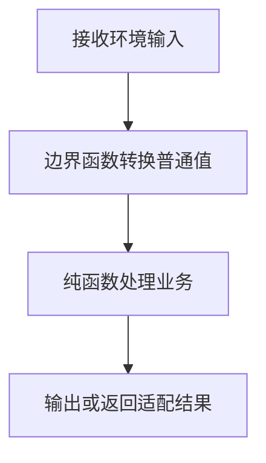

# DAY27 · Practice 01：Day 27 · 运行环境边界独立综合题

[返回当天课程](../README.md)

这是一道完整、独立的主练习。不要导入其他 practice 文件夹中的代码。

## 代码流程图



从零完成一个“课程搜索入口”，同时处理事件、请求和 CLI 参数。

必须名称：`InputEventLike`、`readQuery`、`JsonClient`、`Lesson`、`isRecord`、`loadLesson`、`Options`、`valueAfter`、`parseArgs`。

需求：

1. `readQuery` 读取可为空的 `currentTarget.value`，去掉两端空格；缺失时返回空字符串。
2. `JsonClient.get(path)` 返回 `Promise<unknown>`；`loadLesson` 请求 `/lesson`，只接受字符串 title 和有限数字 minutes，无效时返回 `null`。
3. `parseArgs` 读取 `--day` 与 `--mode` 后一项；day 必须是非负整数，否则默认 0；mode 只有 `example` 时取 example，否则为 practice。
4. 使用与 README 对应的两个假客户端及两组参数输出结果，不依赖真实 DOM、网络或 `process`。

精确输出：

```text
Query: typescript
Missing: empty
Valid: DOM/35
Invalid: rejected
Day: 27
Mode: example
Defaults: 0/practice
```

固定输入：事件值为 `"  typescript  "` 和 null；好响应 `{ title: "DOM", minutes: 35 }`，坏响应的 minutes 为字符串；参数为 `["--day", "27", "--mode", "example"]` 和 `[]`。

限制：不使用 `any`、类型断言、非空断言；不访问真实 `document`、网络或 `process.argv`。

完成标准：右击运行 `practice.ts` 后输出完全一致；三个边界逻辑都是可独立测试的普通函数。

## 本题易漏语法

边界适配函数先把事件、响应、CLI 转成普通局部变量，再传给不读取全局对象的纯函数。

## 文件

- 在 `practice.ts` 中独立作答。
- 独立完成后，再查看 `solution.ts` 的 TODO 代码骨架与 `SOLUTION.md` 的解题结构；两者都不提供完整答案。
