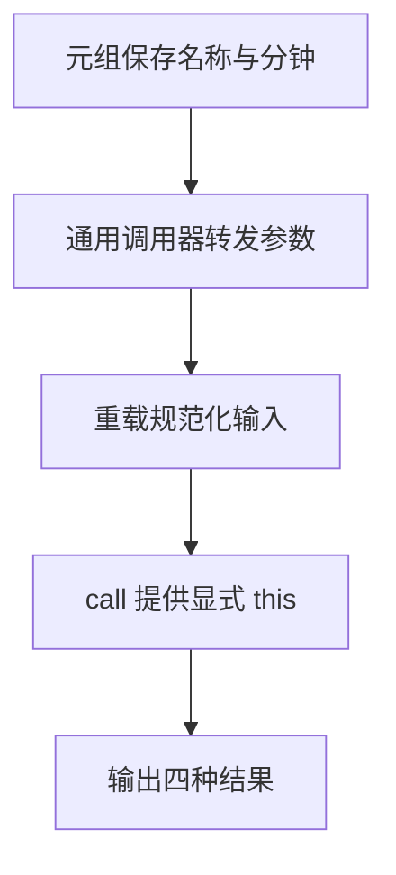

# Day 28（选修）｜元组、重载、`this` 与可变参数

普通业务函数优先使用简单参数和联合类型。本专题帮助你设计或阅读库 API：固定位置的数据、保留整组参数的通用包装器、输入与返回形状不同的重载，以及依赖调用者的 `this`。

建议用时：60–90 分钟。

## 今天会学到

- 用只读元组表达固定长度和位置含义；
- 用剩余参数与可变参数元组保留函数签名；
- 正确排列重载签名和实现签名；
- 用显式 `this` 参数检查调用上下文。

## 核心讲解

`readonly [completed: number, total: number]` 有固定两个位置，与任意长度的 `number[]` 不同。元组标签只帮助阅读，不会成为运行时属性。

通用调用器中的 `Args` 同时出现在函数参数和实参数组，`Result` 同时连接原函数与包装器返回值，因此类型关系不会丢失。重载签名写在实现上方，实现必须覆盖全部分支；如果输入输出关系没有变化，简单联合通常更清楚。

显式 `this` 参数只用于类型检查，不是运行时第一个实参；可以通过 `.call(context, ...)` 提供调用者。

## 函数变量追踪

可变参数元组把一组实参收集进 args，包装器再用 ...args 展开给原函数，原函数 return 的 Result 继续由包装器 return。显式 this 走独立的调用者路径。

## Example 代码流程图

运行 `example.ts` 前先沿图预测执行顺序；运行后再把每个节点对应到代码行。



## 独立练习导航

本日共有 2 道独立练习。每道题都有单独目录、说明、作答文件和解题结构提示；题目之间不共享代码。

| 目录 | 场景 | 类型 |
| --- | --- | --- |
| [practice01](./practice01/README.md) | Day 28 · 高级函数独立综合题 | 主任务 |
| [practice02](./practice02/README.md) | 高级函数调用器 | 闭卷迁移 |

右击任意练习目录中的 `practice.ts` 即可单独检查；命令行也可运行 `npm run beginner -- day28 practice02`。

## 常见错误

- 用 `(number | boolean)[]` 代替固定元组；
- 包装器写成 `any[]` 丢失关系；
- 只写重载签名却没有兼容实现；
- 把显式 this 当成普通第一个参数。

### 错误代码示例

```ts
type Progress = (number | boolean)[];
const progress: Progress = [3, true, 99];
// ❌ 普通数组没有固定长度，也没有保证第二项一定是 total。

function invoke(fn: (...args: any[]) => any, ...args: any[]): any {
  // ❌ any[] 丢掉了参数顺序、参数类型和返回类型之间的关系。
  return fn(...args);
}

function describe(context: CourseContext, prefix: string): string {
  // ❌ 这把 context 变成普通实参，并没有描述调用者 this。
  return `${prefix}: ${context.title}`;
}
```

### 正确写法

```ts
type Progress = readonly [completed: number, total: number];
const progress: Progress = [3, 5]; // ✅ 长度和两个位置的意义都固定。

function invoke<Args extends unknown[], Result>(
  fn: (...args: Args) => Result,
  ...args: Args
): Result {
  // ✅ 同一个 Args 同时约束函数和实参，Result 原样返回。
  return fn(...args);
}

function describe(this: CourseContext, prefix: string): string {
  return `${prefix}: ${this.title}`;
}

// ✅ 显式 this 不是第一个普通实参，而是由 call 提供调用者。
console.log(describe.call({ title: "Functions", day: 28 }, "Day 28"));
```

## 拓展思考（不要求写代码）

`normalize` 能否只用联合参数写成一个函数？比较联合版本与重载版本在调用处返回类型精度和实现可读性上的差别。

## 官方资料

- [More on Functions](https://www.typescriptlang.org/docs/handbook/2/functions.html)
- [Tuple Types](https://www.typescriptlang.org/docs/handbook/2/objects.html#tuple-types)
- [Variadic Tuple Types](https://www.typescriptlang.org/docs/handbook/release-notes/typescript-4-0.html#variadic-tuple-types)
