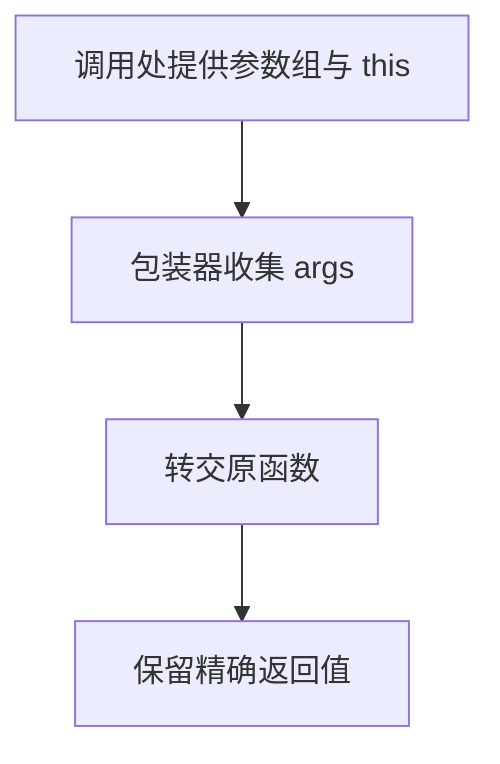

# DAY28 · Practice 01：Day 28 · 高级函数独立综合题

[返回当天课程](../README.md)

这是一道完整、独立的主练习。不要导入其他 practice 文件夹中的代码。

## 代码流程图



从零完成一个“高级函数工具箱”。

必须名称：`ProgressPair`、`progress`、`invoke`、`normalize`、`CourseContext`、`describe`。

需求：

1. `progress([true, false, true, true])` 返回只读元组 `[3, 4]`。
2. `invoke` 使用 `Args extends unknown[]` 与 `Result`，分别调用数字乘法和标题拼接函数。
3. `normalize` 提供字符串重载和只读字符串数组重载；都执行 trim + 小写，返回类型分别是 string 和 string[]。
4. `describe` 有显式 `this: CourseContext` 和 prefix 参数，通过 `.call` 输出课程说明。

精确输出：

```text
Progress: 3/4
Total: 36
Day 28
types
modules, generics
Elective Day 28: Advanced functions
```

固定输入：乘法 12×3；标题函数接收 `"Day "`、28；normalize 输入 `"  TYPES "` 及 `[" Modules ", " GENERICS "]`；上下文 title 为 Advanced functions、day 为 28。

限制：不使用 `any`、类型断言或普通数组冒充元组；实现签名必须覆盖两个重载。

完成标准：右击运行 `practice.ts` 后输出完全一致；能指出每个泛型参数连接了哪些位置，并说明 `this` 参数为何不出现在运行时实参数组中。

## 本题易漏语法

元组类型用 [] 且位置固定；rest 参数写 ...args: Args；显式 this 不是运行时第一个实参。

## 文件

- 在 `practice.ts` 中独立作答。
- 独立完成后，再查看 `solution.ts` 的 TODO 代码骨架与 `SOLUTION.md` 的解题结构；两者都不提供完整答案。
