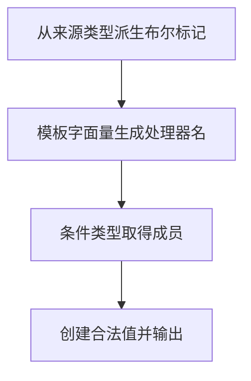

# Day 29（选修）｜从现有类型生成新类型

这一专题更接近库作者和复杂框架代码。只有当许多类型存在稳定、重复的转换规则时，才值得自定义映射类型、条件类型和模板字面量类型；日常业务优先使用清楚的内置工具类型。

建议用时：60–90 分钟。

## 今天会学到

- 用映射类型遍历已有对象的键；
- 用条件类型和 `infer` 提取数组元素；
- 用键重映射与模板字面量生成处理器名；
- 用品牌类型防止结构相同的标识符被误传；
- 区分类型层转换与运行时验证。

## 核心讲解

映射类型 `[Key in keyof T]` 逐个产生属性；条件类型 `T extends readonly (infer Item)[] ? Item : never` 从数组结构中提取元素。它们只在类型检查阶段工作，不会生成运行时循环。

键重映射可以把 `ready` 系统地变成 `onReady`，同时保留对应负载。品牌类型运行时仍是字符串；它只在类型层阻止误传，格式安全必须由一个集中构造函数先验证。验证后的窄断言应只留在这个边界。

## Example 代码流程图

运行 `example.ts` 前先沿图预测执行顺序；运行后再把每个节点对应到代码行。



## 独立练习导航

本日共有 2 道独立练习。每道题都有单独目录、说明、作答文件和解题结构提示；题目之间不共享代码。

| 目录 | 场景 | 类型 |
| --- | --- | --- |
| [practice01](./practice01/README.md) | Day 29 · 类型派生独立综合题 | 主任务 |
| [practice02](./practice02/README.md) | 界面类型派生 | 闭卷迁移 |

右击任意练习目录中的 `practice.ts` 即可单独检查；命令行也可运行 `npm run beginner -- day29 practice02`。

## 常见错误

- 能用内置工具类型却先写复杂条件类型；
- 提取元素时写 `T[keyof T]`，混入数组方法；
- 模板键没有限制为字符串；
- 期待类型转换在运行时改造对象；
- 到处把 string 断言成品牌值。

### 错误代码示例

```ts
type ElementOf<T> = T[keyof T];
// ❌ 对数组使用时还会混入 length、数组方法等成员类型。

declare const userIdBrand: unique symbol;
type UserId = string & { readonly [userIdBrand]: true };

const id = rawInput as UserId;
// ❌ 到处断言品牌值，任何普通字符串都能绕过格式检查。
```

### 正确写法

```ts
type ElementOf<T> = T extends readonly (infer Item)[] ? Item : never;
// ✅ infer 只提取数组元素，不会把数组方法混进结果。

declare const userIdBrand: unique symbol;
type UserId = string & { readonly [userIdBrand]: true };

function createUserId(value: string): UserId {
  if (!value.startsWith("usr_") || value.length <= 4) {
    throw new Error("Invalid user id");
  }
  // ✅ 窄断言只集中在已经完成运行时验证的构造边界。
  return value as UserId;
}
```

## 拓展思考（不要求写代码）

哪些部分可以直接改用 `Record`、`Awaited` 或其他内置工具类型？在什么情况下“少写一个自定义高级类型”反而能让项目更安全？

## 官方资料

- [Creating Types from Types](https://www.typescriptlang.org/docs/handbook/2/types-from-types.html)
- [Mapped Types](https://www.typescriptlang.org/docs/handbook/2/mapped-types.html)
- [Conditional Types](https://www.typescriptlang.org/docs/handbook/2/conditional-types.html)
- [Template Literal Types](https://www.typescriptlang.org/docs/handbook/2/template-literal-types.html)
