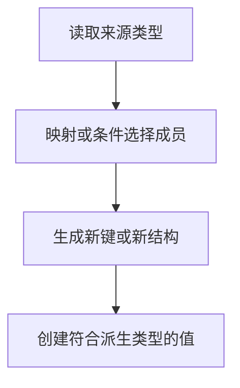

# DAY29 · Practice 01：Day 29 · 类型派生独立综合题

[返回当天课程](../README.md)

这是一道完整、独立的主练习。不要导入其他 practice 文件夹中的代码。

## 代码流程图



从零完成“类型派生工具箱”。

必须名称：`FeatureConfig`、`Flags`、`ElementOf`、`Events`、`Handlers`、`userIdBrand`、`UserId`、`createUserId`、`profilePath`。

需求：

1. `Flags<T>` 保留 T 的全部键，把值统一变成 boolean。
2. `ElementOf<T>` 从只读元组 `["types", "modules"] as const` 提取字面量联合，并选择 modules。
3. `Handlers<Events>` 把 ready、failed 重映射成 `onReady`、`onFailed`，各自参数保持对应负载类型。
4. `UserId` 是带 unique symbol 品牌的字符串；`createUserId` 只接受以 `usr_` 开头且后面非空的值，否则抛错；验证成功后只在这里使用一次窄断言。
5. `profilePath` 只接受 UserId。

精确输出：

```text
Flags: dark=true, retries=false
Selected: modules
Ready at 29
Failed: invalid
/users/usr_42
```

限制：不使用 `any`；不能把普通字符串直接断言成 UserId；品牌构造器必须先做运行时格式检查。

完成标准：右击运行 `practice.ts` 后输出完全一致且类型检查通过；能在纸上展开 Flags 和 Handlers 的最终对象形状。

## 本题易漏语法

映射类型在类型花括号中迭代键，模板字面量类型用反引号；这些类型语法不生成运行时对象。

## 文件

- 在 `practice.ts` 中独立作答。
- 独立完成后，再查看 `solution.ts` 的 TODO 代码骨架与 `SOLUTION.md` 的解题结构；两者都不提供完整答案。
