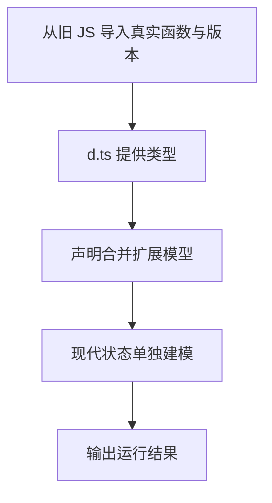

# Day 30（选修）｜声明文件与旧式 TypeScript

现代 npm 包通常自带类型，但维护旧 JavaScript 或历史代码时会遇到 `.d.ts`、声明合并、枚举与命名空间。目标是准确消费这些边界，不是在新项目中默认复制旧风格。

建议用时：60–90 分钟。

## 今天会学到

- 理解 `.d.ts` 只描述运行时，不生成 JavaScript；
- 对照 JavaScript 导出与声明文件；
- 识别同名 interface 的声明合并；
- 把旧 enum 归一化成现代字面量状态；
- 知道错误声明会让编译器相信不真实的行为。

## 核心讲解

```text
真实 JavaScript 行为 ←必须吻合→ .d.ts 声明 ←供检查→ TypeScript 调用者
```

本目录的 `score.js` 是运行时代码，`score.d.ts` 描述其参数和返回值。声明里的 `declare function` 不会创建函数；删除真实 JS 后，运行时仍会失败。

同名 interface 会合并，适合扩展外部声明；type alias 不会这样合并。`enum` 常见于旧代码，新代码通常可用 `as const` 对象加字面量联合，既直观又符合 ES 模块习惯。

## Example 代码流程图

运行 `example.ts` 前先沿图预测执行顺序；运行后再把每个节点对应到代码行。



## 独立练习导航

本日共有 2 道独立练习。每道题都有单独目录、说明、作答文件和解题结构提示；题目之间不共享代码。

| 目录 | 场景 | 类型 |
| --- | --- | --- |
| [practice01](./practice01/README.md) | Day 30 · 声明文件与旧代码独立综合题 | 主任务 |
| [practice02](./practice02/README.md) | 旧模块声明适配 | 闭卷迁移 |

右击任意练习目录中的 `practice.ts` 即可单独检查；命令行也可运行 `npm run beginner -- day30 practice02`。

## 常见错误

- 以为 `.d.ts` 会生成实现；
- 声明与真实 JS 的参数或返回类型不一致；
- 期待 type alias 像 interface 一样合并；
- 新模块继续用 namespace 组织代码；
- 用断言掩盖错误声明。

### 错误代码示例

```ts
// score.js 的真实实现返回 number：
export function score(values) {
  return values.reduce((sum, value) => sum + value, 0);
}

// score.d.ts 却这样声明：
export declare function score(values: number[]): string;
// ❌ 声明让编译器相信了错误的返回类型，却不会改变真实 JS。
```

### 正确写法

```ts
// score.d.ts 必须忠实描述 score.js 已存在的参数与返回值：
export declare function score(values: readonly number[]): number;

// ✅ .d.ts 只提供类型；运行时仍由 score.js 提供真正实现。
import { score } from "./score.js";
console.log(score([10, 20]).toFixed(0));
```

## 拓展思考（不要求写代码）

如果 `score.js` 实际开始忽略负数，但 `.d.ts` 完全没有变化，TypeScript 能发现这次业务行为变更吗？应由哪类测试保护它？

## 官方资料

- [Type Declarations](https://www.typescriptlang.org/docs/handbook/2/type-declarations.html)
- [Declaration Files](https://www.typescriptlang.org/docs/handbook/declaration-files/introduction.html)
- [Declaration Merging](https://www.typescriptlang.org/docs/handbook/declaration-merging.html)
- [Enums](https://www.typescriptlang.org/docs/handbook/enums.html)
