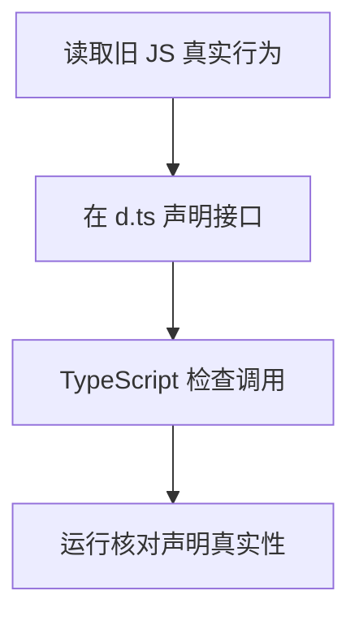

# DAY30 · Practice 01：Day 30 · 声明文件与旧代码独立综合题

[返回当天课程](../README.md)

这是一道完整、独立的主练习。不要导入其他 practice 文件夹中的代码。

## 代码流程图



只编辑 `practice.ts`，从零完成“旧模块兼容入口”；不要修改 `score.js` 或 `score.d.ts`。

必须名称：`LessonInfo`、`LegacyStatus`、`ModernStatus`、`normalizeStatus`。还要从 `./score.js` 导入 `score`。

需求：

1. 阅读两个 score 文件，给 `[10, 20, 30]` 求和，并用 number 接收结果。
2. 写两段同名 `LessonInfo` interface：第一段 title，第二段 minutes；创建 Declarations / 35 对象。
3. 写 `LegacyStatus` 数字枚举 Draft、Published。
4. 写现代 `ModernStatus` 常量对象与同名字面量联合类型，值为 draft、published。
5. `normalizeStatus` 同时接受旧枚举和现代状态，并统一返回 ModernStatus。

精确输出：

```text
Score: 60
Declarations: 35 minutes
Legacy: published
Modern: draft
```

限制：不使用 `any`、类型断言或 namespace；不要修改辅助模块来迎合调用代码。

完成标准：右击运行 `practice.ts` 后输出完全一致；能指出 `.js`、`.d.ts`、`.ts` 中哪些代码会在运行时执行，以及声明错误会造成什么风险。

## 本题易漏语法

.d.ts 只写声明不写实现；声明以分号结束，并与 JS 的真实导出和结果一致。

## 文件

- 在 `practice.ts` 中独立作答。
- 独立完成后，再查看 `solution.ts` 的 TODO 代码骨架与 `SOLUTION.md` 的解题结构；两者都不提供完整答案。
